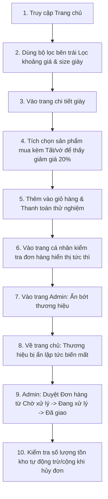

# 👟 SHOES STORE - HƯỚNG DẪN DEMO BÁO CÁO CÁC CHỨC NĂNG DỰ ÁN

Tài liệu này tổng hợp toàn bộ các chức năng đã xây dựng và tối ưu hóa trong hệ thống Shoes Store, đóng vai trò là kịch bản demo giúp giảng viên dễ dàng đánh giá toàn diện dự án.

---

## 🏗️ 1. TỔNG QUAN HỆ THỐNG & CÔNG NGHỆ

- **Frontend:** React.js, Vite, Vanilla CSS (Thiết kế hiện đại, Glassmorphic UI, hiệu ứng mượt mà).
- **Backend:** Node.js, Express, RESTful APIs.
- **Cơ sở dữ liệu:** MySQL (Truy vấn tối ưu, xử lý ràng buộc nhất quán).
- **Tính năng đặc biệt:** Tích hợp AI tư vấn sản phẩm & Đo kích cỡ chân thông minh.

---

## 🛍️ 2. CÁC CHỨC NĂNG DÀNH CHO KHÁCH HÀNG (CUSTOMER)

### 🔹 A. Bộ lọc thông minh tại Trang chủ (Brand Sidebar Filter)
- **Vị trí:** Thanh bên trái khi người dùng chọn xem theo Thương hiệu.
- **Tính năng:**
  - Lọc theo **Khoảng giá (VNĐ)** nhập tay trực quan.
  - Lọc nhanh theo **Kích cỡ giày (Size)** từ 36 - 45.
  - **Nhãn hiển thị bộ lọc (Active Chips):** Hiển thị các tiêu chí đang lọc dưới dạng thẻ để người dùng có thể xóa nhanh từng bộ lọc riêng lẻ.
  - Tự động lọc các sản phẩm của thương hiệu và phân loại tương ứng theo giới tính.

### 🔹 B. Tính năng ưu đãi mua kèm phụ kiện (Cross-Sell Combo Discount)
Hệ thống khuyến khích người dùng mua phụ kiện để nhận ưu đãi lớn:
- **Phụ kiện mua kèm (Chiết khấu 20%):**
  - Tại trang chi tiết giày, phần **"Sản phẩm mua kèm"** đề xuất các phụ kiện liên quan (tất, dây giày, chai xịt vệ sinh...).
  - Khi tích chọn, giá phụ kiện sẽ được **giảm 20%** ngay lập tức và đồng bộ vào giỏ hàng/thanh toán.
  - Phụ kiện mua lẻ từ trang chủ hoặc danh mục khác (không đi kèm giày) sẽ **giữ nguyên giá gốc**.
- **Combo 3 món hoàn chỉnh (Giảm 15% toàn bộ):**
  - Đề xuất trọn bộ phối màu: **1 Giày + 1 Tất + 1 Dây giày** cùng thương hiệu.
  - Khi mua combo này, tổng giá trị toàn bộ combo sẽ được **giảm 15%**.

### 🔹 C. Trang chi tiết sản phẩm tối ưu trải nghiệm (Product Details)
- **Tồn kho thực tế theo Size:** Chọn kích cỡ nào sẽ hiển thị số lượng tồn kho còn lại của size đó. Cảnh báo cháy hàng khi tồn kho <= 5 sản phẩm.
- **Hỗ trợ chọn size:** Nút gọi hỗ trợ nhanh qua số điện thoại CSKH.
- **Đánh giá & Phản hồi:** Hiển thị đánh giá trung bình hình ngôi sao kèm nhận xét từ người mua trước đó (gồm nhãn "Đã mua hàng" xác thực).

### 🔹 D. Trợ lý tư vấn AI & Đo size chân thông minh
- **Trợ lý AI (AI Assistant):** Hỗ trợ chat tự nhiên để tìm kiếm giày phù hợp với mục đích sử dụng (chạy bộ, bóng rổ, thời trang...).
- **Đo size chân bằng AI (AI Foot Measurement):** Người dùng chụp/tải ảnh bàn chân, hệ thống AI tự động phân tích và đưa ra size giày chính xác kèm theo độ rộng chân thích hợp.

### 🔹 E. Giỏ hàng & Thanh toán điện tử (VNPay)
- Drawer giỏ hàng trượt mượt mà từ bên phải, cập nhật số lượng và tổng tiền theo thời gian thực (tự động áp dụng chiết khấu combo).
- Hỗ trợ thanh toán an toàn qua cổng **VNPay**.

### 🔹 F. Trang thông tin cá nhân & Theo dõi đơn hàng (Order Tracker)
- **Tracker badges:** Badge hiển thị số lượng đơn hàng tức thì cho từng trạng thái: *Chờ xử lý, Đang xử lý, Đang giao hàng, Hoàn thành, Đã hủy/Hoàn tiền*.
- Số lượng đơn hàng được tự động làm mới ngay khi vừa truy cập trang cá nhân (không cần F5 lại trang).

---

## ⚡ 3. CÁC CHỨC NĂNG DÀNH CHO QUẢN TRỊ VIÊN (ADMIN)

### 🔹 A. Quản lý sản phẩm & Phân loại thông minh
- Admin có thể thêm mới/chỉnh sửa sản phẩm, chọn danh mục con dễ dàng.
- Tự động lọc/ẩn phụ kiện ở trang chủ, chỉ hiện phụ kiện khi người dùng truy cập trực tiếp danh mục phụ kiện.

### 🔹 B. Quản lý chương trình Flash Sale
- **Tạo & Cập nhật chiến dịch:** Nút **"Sửa"** chiến dịch Flash Sale cho phép thay đổi thời gian bắt đầu, kết thúc, số lượng mở bán mà vẫn bảo toàn số lượng đã bán trước đó.
- Cảnh báo trạng thái Flash Sale (đang diễn ra, sắp diễn ra) hiển thị trực tiếp bằng bộ đếm ngược thời gian thực trên trang chi tiết sản phẩm.

### 🔹 C. Quản lý trạng thái ẩn/hiện thương hiệu (Active Status)
- Admin có thể tạm ẩn các thương hiệu không kinh doanh (ví dụ: *2XU*, *Bahe Studio*...).
- Các thương hiệu bị tạm ẩn sẽ **ngay lập tức biến mất khỏi trang chủ** và các sản phẩm của thương hiệu đó cũng không hiển thị trong đề xuất mua kèm (nhờ công cụ chống lưu cache - Cache Buster).

### 🔹 D. Quản lý đơn hàng & Cập nhật kho tự động
- **Chờ xử lý:** Đơn hàng vừa đặt thành công.
- **Đang xử lý:** Admin xác nhận đơn hàng -> Hệ thống tự động **trừ kho số lượng sản phẩm tương ứng**.
- **Đang giao hàng:** Chuyển sang trạng thái giao hàng.
- **Hoàn thành:** Khi Admin xác nhận đã giao hàng, hệ thống tự động cập nhật **Trạng thái thanh toán của đơn hàng thành "Đã thanh toán"**.
- **Đã hủy:** Nếu Admin hủy đơn hàng, hệ thống tự động **cộng lại số lượng sản phẩm vào kho hàng**.

---

## 🏃 4. KỊCH BẢN DEMO TỪNG BƯỚC CHO GIẢNG VIÊN (DEMO FLOW)

Giảng viên có thể thực hiện theo các bước sau để thấy toàn bộ các chức năng vận hành nhịp nhàng:

### Bước 1: Trải nghiệm bộ lọc trang chủ
1. Vào trang chủ, bấm chọn một thương hiệu (ví dụ: **Adidas**).
2. Tại thanh bộ lọc bên trái, gõ khoảng giá **Từ: 1.000.000** và **Đến: 2.000.000**, chọn **Size: 39** rồi nhấn **ÁP DỤNG BỘ LỌC**.
3. Hệ thống sẽ lọc ra các đôi giày Adidas có khoảng giá và kích cỡ tương ứng. Có thể bấm biểu tượng `×` trên chip bộ lọc ở trên để xóa nhanh bộ lọc.

### Bước 2: Trải nghiệm tính năng mua kèm phụ kiện (Giảm 20%)
1. Nhấn vào một đôi giày bất kỳ để xem chi tiết.
2. Cuộn xuống phần **Sản phẩm mua kèm**. Bấm chọn một đôi tất.
3. Quan sát: Giá gốc của tất là **150.000đ** sẽ hiển thị giá giảm **120.000đ (-20%)**. Bảng tổng thanh toán bên dưới sẽ tự động cộng dồn giá giày + giá tất đã giảm 20%.
4. Bấm **THÊM GIỎ** rồi mở giỏ hàng kiểm tra, giá của tất trong giỏ hàng vẫn giữ nguyên ưu đãi giảm 20%.

### Bước 3: Đăng nhập & Kiểm tra Đơn hàng ở Profile
1. Đăng ký/Đăng nhập tài khoản khách hàng.
2. Bấm vào **👤 Cá nhân** trên thanh điều hướng.
3. Badge đếm số lượng đơn hàng ở các cột trạng thái hiển thị ngay lập tức không cần tải lại trang.

### Bước 4: Ẩn thương hiệu ở Admin
1. Đăng nhập tài khoản admin.
2. Vào **Quản Lý Thương Hiệu**. Bấm **Ẩn** thương hiệu **2XU**.
3. Quay trở về trang chủ, kiểm tra thanh thương hiệu: nút **Giày 2XU** đã hoàn toàn biến mất khỏi giao diện khách hàng.

### Bước 5: Cập nhật đơn hàng & Tự động đổi trạng thái thanh toán
1. Vào **Quản Lý Đơn Hàng** ở Admin.
2. Chọn đơn hàng vừa mua. Tiến hành xác nhận duyệt đơn thành **Đang xử lý** (Sản phẩm sẽ tự động trừ kho tương ứng).
3. Đổi trạng thái đơn hàng sang **Đã giao**.
4. Quay lại trang lịch sử mua hàng, đơn hàng đó sẽ chuyển sang cột **Hoàn thành** và Trạng thái thanh toán tự động chuyển thành **Đã thanh toán (Paid)**.

---

## 🛒 5. LUỒNG DEMO CHI TIẾT: TỪ ĐĂNG NHẬP ĐẾN MUA HÀNG THÀNH CÔNG (END-TO-END)

Dưới đây là các bước chi tiết để thầy cô thực hiện kiểm thử trọn vẹn luồng mua hàng của khách hàng:

### Bước 1: Đăng nhập tài khoản khách hàng
1. Bấm vào nút **Đăng nhập** trên thanh điều hướng ở góc trên bên phải trang chủ.
2. Nhập thông tin đăng nhập mẫu (hoặc bấm **Đăng ký** nếu chưa có tài khoản):
   - **Email:** `khachhang@gmail.com`
   - **Mật khẩu:** `123456`
3. Nhấn **Đăng nhập**. Sau khi đăng nhập thành công, góc trên bên phải sẽ hiển thị nút quản lý tài khoản: `👤 Chào, [Tên]`.

### Bước 2: Chọn sản phẩm & Trải nghiệm tính năng mua kèm phụ kiện
1. Tại trang chủ, chọn xem một thương hiệu bất kỳ (ví dụ: **Giày Adidas** hoặc **Giày Nike**).
2. Bấm vào sản phẩm mong muốn để xem chi tiết (ví dụ: *Giày Adidas Ultraboost 5X Nữ*).
3. Bấm chọn một kích cỡ giày mong muốn (ví dụ: *Size 37*).
4. Cuộn xuống phần **Sản phẩm mua kèm** bên dưới:
   - Tích chọn một đôi tất (ví dụ: *Vớ Thể Thao Under Armour Performance Tech Crew*).
   - Kiểm tra mức giá: Giá của đôi tất từ **150.000đ** gốc được giảm trực tiếp **-20%** chỉ còn **120.000đ**.
   - Bảng tổng thanh toán sẽ hiển thị đúng tổng giá trị của giày + đôi tất đã giảm giá.

### Bước 3: Đi đến Giỏ hàng & Thanh toán
1. Nhấn nút **⚡ MUA HÀNG NGAY** (hoặc bấm **THÊM GIỎ** -> mở giỏ hàng bên phải và chọn **Thanh toán ngay**).
2. Tại trang **Thanh toán (Checkout)**, nhập đầy đủ thông tin giao hàng:
   - **Tên người nhận:** Nguyễn Văn A
   - **Số điện thoại:** 0987654321
   - **Địa chỉ giao hàng:** 123 Đường Cộng Hòa, Phường 13, Quận Tân Bình, TP. HCM
3. Chọn hình thức thanh toán phù hợp:
   - **Thanh toán khi nhận hàng (COD)**: Đơn hàng sẽ được khởi tạo lập tức.
   - **Cổng thanh toán VNPay**: Hệ thống sẽ chuyển hướng bạn sang trang cổng Sandbox của VNPay để nhập thông tin thẻ test.

### Bước 4: Hoàn thành đặt hàng & Theo dõi đơn hàng
1. Bấm nút **Đặt Hàng** (hoặc hoàn tất giao dịch VNPay).
2. Màn hình hiển thị trang **Đặt hàng thành công** cùng mã hóa đơn.
3. Bấm vào tên tài khoản cá nhân `👤 Chào, ...` ở góc trên -> Chọn **👤 Cá nhân**.
4. Trình theo dõi đơn hàng tại đây sẽ lập tức ghi nhận đơn hàng mới ở tab **Chờ xử lý** với đầy đủ thông tin và giá trị đơn hàng được tính chính xác!

