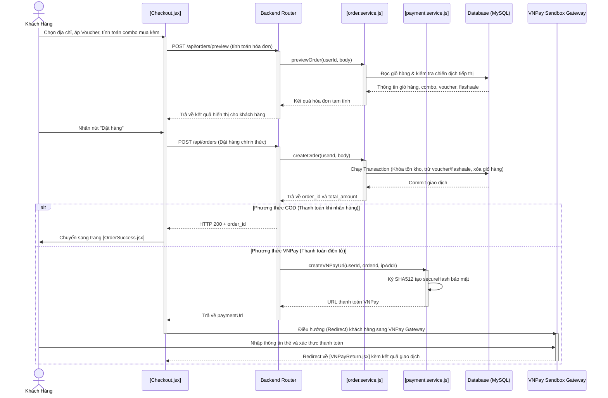
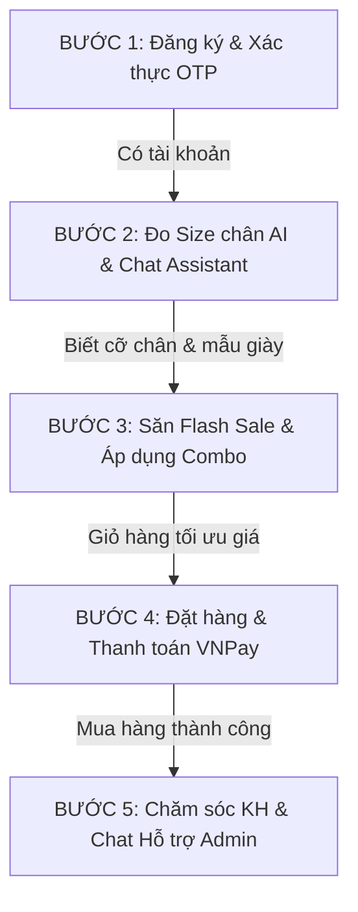

# 📦 TÀI LIỆU QUY TRÌNH HỆ THỐNG SHOES STORE: GIAO DỊCH, THANH TOÁN, TIẾP THỊ, BẢO MẬT & CHĂM SÓC KHÁCH HÀNG

Tài liệu này mô tả toàn diện, chi tiết và bám sát mã nguồn thực tế của dự án **Shoes Store**, cung cấp kịch bản hoạt động và cách triển khai kỹ thuật của 5 phân hệ cốt lõi trong hệ thống: **Giao dịch (Đặt hàng)**, **Thanh toán (COD & VNPay)**, **Tiếp thị & Khuyến mại**, **Bảo mật Hệ thống** và **Chăm sóc Khách hàng**.

---

## 🗺️ 1. Sơ đồ Hoạt động Tổng quan (System Overview Flow)



---

## 🗺️ 1.2. Các Sơ đồ Quy trình Nghiệp vụ BPMN (BPMN Business Process Flows)

Dưới đây là các sơ đồ quy trình nghiệp vụ BPMN mô tả chi tiết các phân luồng xử lý từ Khách hàng, Frontend, Backend, đến Cổng thanh toán VNPay, Dịch vụ AI và hệ thống Quản lý của Admin:

### 1. Sơ đồ BPMN: Quy trình Giao dịch & Thanh toán (Transaction & Payment Flow)

```mermaid
flowchart TD
    %% Định nghĩa các Lane (Làn) trong quy trình
    subgraph KH ["Khách Hàng (Customer)"]
        KH_Start([Bắt đầu mua hàng])
        KH_ChonSP[1. Chọn SP, địa chỉ & áp Voucher]
        KH_XacNhan[2. Nhấn nút Đặt hàng]
        KH_ThanhToanVNPay[3a. Thực hiện thanh toán thẻ]
        KH_NhanEmail[4a. Nhận email hóa đơn thành công]
        KH_NhanHang[4b. Nhận hàng & Trả tiền/Ký nhận]
        KH_EndSuccess([Giao dịch hoàn tất])
        KH_EndFail([Giao dịch thất bại/Hủy])
    end

    subgraph FE ["Giao diện (Frontend App)"]
        FE_Preview[Gửi yêu cầu Xem trước]
        FE_HienThiPreview[Hiển thị hóa đơn tạm tính]
        FE_GuiOrder[Gửi yêu cầu đặt hàng POST /api/orders]
        FE_CheckPT{Kiểm tra PTTT?}
        FE_SuccessPage[Hiển thị trang OrderSuccess.jsx]
        FE_RedirectVNPay[Redirect sang VNPay Gateway]
        FE_VNPayReturn[Nhận kết quả & gọi API Verify]
        FE_HienThiKetQua[Hiển thị thông báo kết quả]
    end

    subgraph BE ["Hệ thống xử lý (Backend API)"]
        BE_CalcPreview[Xử lý previewOrder: tính combo, voucher, flashsale, ship]
        BE_Transaction[Khởi tạo MySQL Transaction]
        BE_CheckKho{Kiểm tra tồn kho & Khóa Flashsale FOR UPDATE}
        BE_Rollback[Rollback DB & Trả lỗi 400]
        BE_Commit[Commit: tạo Order, Payment, xóa giỏ hàng]
        BE_CreateVNPay[Tạo URL VNPay & ký HMAC-SHA512]
        BE_VerifyVNPay[Xác thực chữ ký & vnp_ResponseCode]
        BE_IPN[Webhook IPN xử lý giao dịch độc lập]
        BE_UpdateSuccess[Cập nhật trạng thái paid/confirmed, trừ kho & gửi mail]
        BE_AdminUpdate[Cập nhật Delivered -> Trạng thái paid & success]
    end

    subgraph VP ["Cổng thanh toán (VNPay Sandbox)"]
        VP_Gate[Xử lý giao dịch tại cổng VNPay]
        VP_Redirect[Redirect khách về Return URL]
        VP_SendIPN[Gửi Webhook IPN Callback]
    end

    subgraph AD ["Quản trị viên (Admin System)"]
        AD_Duyet[Admin duyệt đơn hàng confirmed]
        AD_Giao[Giao đơn vị vận chuyển]
    end

    %% Luồng kết nối nghiệp vụ
    KH_Start --> KH_ChonSP
    KH_ChonSP --> FE_Preview
    FE_Preview --> BE_CalcPreview
    BE_CalcPreview --> FE_HienThiPreview
    FE_HienThiPreview --> KH_XacNhan
    KH_XacNhan --> FE_GuiOrder
    FE_GuiOrder --> BE_Transaction
    BE_Transaction --> BE_CheckKho

    %% Nhánh kiểm tra tồn kho
    BE_CheckKho -- "Hết hàng / Lỗi" --> BE_Rollback
    BE_Rollback --> FE_HienThiKetQua
    FE_HienThiKetQua --> KH_EndFail

    BE_CheckKho -- "Còn hàng" --> BE_Commit
    BE_Commit --> FE_CheckPT

    %% Nhánh COD
    FE_CheckPT -- "COD" --> FE_SuccessPage
    FE_SuccessPage --> AD_Duyet
    AD_Duyet --> AD_Giao
    AD_Giao --> BE_AdminUpdate
    BE_AdminUpdate --> KH_NhanHang
    KH_NhanHang --> KH_EndSuccess

    %% Nhánh VNPay
    FE_CheckPT -- "VNPay" --> BE_CreateVNPay
    BE_CreateVNPay --> FE_RedirectVNPay
    FE_RedirectVNPay --> KH_ThanhToanVNPay
    KH_ThanhToanVNPay --> VP_Gate
    
    VP_Gate --> VP_Redirect
    VP_Gate --> VP_SendIPN
    
    VP_Redirect --> FE_VNPayReturn
    FE_VNPayReturn --> BE_VerifyVNPay
    VP_SendIPN --> BE_IPN
    
    BE_VerifyVNPay --> BE_UpdateSuccess
    BE_IPN --> BE_UpdateSuccess
    
    BE_UpdateSuccess --> FE_HienThiKetQua
    FE_HienThiKetQua --> KH_NhanEmail
    KH_NhanEmail --> AD_Giao
    AD_Giao --> KH_NhanHang

    %% CSS Styling
    classDef start_end fill:#d4edda,stroke:#28a745,stroke-width:2px;
    classDef fail fill:#f8d7da,stroke:#dc3545,stroke-width:2px;
    classDef gateway fill:#fff3cd,stroke:#ffc107,stroke-width:2px;
    classDef task fill:#e8f4fd,stroke:#17a2b8,stroke-width:1.5px;
    
    class KH_Start,KH_EndSuccess,start_end;
    class KH_EndFail,fail;
    class FE_CheckPT,BE_CheckKho,gateway;
    class KH_ChonSP,KH_XacNhan,KH_ThanhToanVNPay,KH_NhanEmail,KH_NhanHang,FE_Preview,FE_HienThiPreview,FE_GuiOrder,FE_SuccessPage,FE_RedirectVNPay,FE_VNPayReturn,FE_HienThiKetQua,BE_CalcPreview,BE_Transaction,BE_Rollback,BE_Commit,BE_CreateVNPay,BE_VerifyVNPay,BE_IPN,BE_UpdateSuccess,BE_AdminUpdate,VP_Gate,VP_Redirect,VP_SendIPN,AD_Duyet,AD_Giao,task;
```

### 2. Sơ đồ BPMN: Quy trình Đăng ký & Xác thực OTP Email (User Registration & OTP Verification)

```mermaid
flowchart TD
    %% Định nghĩa các Lane (Làn)
    subgraph KH ["Khách Hàng (Customer)"]
        OTP_Start([Bắt đầu đăng ký])
        OTP_DienForm[1. Nhập thông tin đăng ký]
        OTP_CheckMail[2. Kiểm tra email nhận OTP]
        OTP_NhapOTP[3. Nhập mã OTP vào trang web]
        OTP_EndSuccess([Đăng ký thành công])
        OTP_EndFail([Hủy / Đăng ký thất bại])
    end

    subgraph FE ["Giao diện (Frontend App)"]
        OTP_YeuCauDK[Gửi yêu cầu đăng ký]
        OTP_HienThiOTP[Hiển thị giao diện nhập OTP]
        OTP_GuiVerify[Gửi mã OTP để xác thực]
        OTP_HienThiThanhCong[Hiển thị thông báo thành công]
    end

    subgraph BE ["Hệ thống xử lý (Backend API)"]
        OTP_Validate[Validate dữ liệu & Băm mật khẩu bcrypt]
        OTP_GenOTP[Tạo OTP 6 số & Băm OTP]
        OTP_SavePending[Lưu thông tin tạm vào otp_pending]
        OTP_GuiMail[Gọi Nodemailer gửi mail OTP]
        OTP_VerifyOTP{Kiểm tra OTP khớp & hạn 5 phút?}
        OTP_SaveUser[Lưu User chính thức vào users & Xóa otp_pending]
        OTP_ReturnError[Trả về lỗi OTP không hợp lệ]
    end

    subgraph MailService ["Dịch vụ Email (SMTP)"]
        OTP_Send[Gửi email chứa OTP đến khách hàng]
    end

    subgraph Cron ["Cron Job (Quét dọn)"]
        OTP_CronRun([Mỗi 10 phút chạy ngầm])
        OTP_CronClean[Xóa các bản ghi otp_pending hết hạn]
    end

    %% Luồng kết nối nghiệp vụ
    OTP_Start --> OTP_DienForm
    OTP_DienForm --> OTP_YeuCauDK
    OTP_YeuCauDK --> OTP_Validate
    OTP_Validate --> OTP_GenOTP
    OTP_GenOTP --> OTP_SavePending
    OTP_SavePending --> OTP_GuiMail
    OTP_GuiMail --> OTP_Send
    OTP_Send --> OTP_CheckMail
    OTP_CheckMail --> OTP_NhapOTP
    OTP_NhapOTP --> OTP_GuiVerify
    OTP_GuiVerify --> OTP_VerifyOTP
    
    OTP_VerifyOTP -- "Hợp lệ & Còn hạn" --> OTP_SaveUser
    OTP_SaveUser --> OTP_HienThiThanhCong
    OTP_HienThiThanhCong --> OTP_EndSuccess
    
    OTP_VerifyOTP -- "Sai hoặc Hết hạn" --> OTP_ReturnError
    OTP_ReturnError --> OTP_HienThiOTP
    OTP_HienThiOTP --> OTP_NhapOTP
    
    %% Luồng chạy Cron Job
    OTP_CronRun --> OTP_CronClean
    OTP_CronClean --> OTP_EndFail

    %% CSS Styling
    classDef start_end fill:#d4edda,stroke:#28a745,stroke-width:2px;
    classDef fail fill:#f8d7da,stroke:#dc3545,stroke-width:2px;
    classDef gateway fill:#fff3cd,stroke:#ffc107,stroke-width:2px;
    classDef task fill:#e8f4fd,stroke:#17a2b8,stroke-width:1.5px;
    
    class OTP_Start,OTP_EndSuccess,start_end;
    class OTP_EndFail,fail;
    class OTP_VerifyOTP,gateway;
    class OTP_DienForm,OTP_CheckMail,OTP_NhapOTP,OTP_YeuCauDK,OTP_HienThiOTP,OTP_GuiVerify,OTP_HienThiThanhCong,OTP_Validate,OTP_GenOTP,OTP_SavePending,OTP_GuiMail,OTP_SaveUser,OTP_ReturnError,OTP_Send,OTP_CronRun,OTP_CronClean,task;
```

### 3. Sơ đồ BPMN: Quy trình Thiết lập & Mua hàng Flash Sale (Flash Sale Campaign & Purchase)

```mermaid
flowchart TD
    subgraph AD ["Quản trị viên (Admin)"]
        FS_AdminStart([Bắt đầu cấu hình])
        FS_NhapThongTin[Thiết lập: SP, giá flash_price, số lượng, khung giờ]
        FS_GuiConfig[Gửi yêu cầu tạo Flash Sale]
    end

    subgraph KH ["Khách Hàng (Customer)"]
        FS_CustomerStart([Bắt đầu mua hàng])
        FS_XemSP[Xem SP đang Flash Sale]
        FS_Countdown[Xem đếm ngược thời gian thực]
        FS_BamMua[Nhấn đặt mua sản phẩm]
        FS_EndSuccess([Mua hàng Flash Sale thành công])
        FS_EndFail([Không mua được sản phẩm])
    end

    subgraph FE ["Giao diện (Frontend App)"]
        FE_HienThiAdmin[Hiển thị trang quản trị Flashsales.jsx]
        FE_HienThiDetail[Hiển thị Countdown & Giá ưu đãi]
        FE_GuiOrder[Gửi yêu cầu tạo đơn hàng]
        FE_ThongBaoSuccess[Hiển thị đơn hàng thành công]
        FE_ThongBaoFail[Thông báo hết hàng Flash Sale]
    end

    subgraph BE ["Hệ thống xử lý (Backend API)"]
        BE_SaveFS[Lưu chiến dịch Flash Sale vào DB]
        BE_CheckTime{Trong khung giờ Flash Sale?}
        BE_LockForUpdate[Khởi chạy DB Transaction & LOCK FOR UPDATE dòng item]
        BE_CheckStock{Tồn kho Flash Sale còn đủ?}
        BE_TruStock[Trừ kho Flash Sale & Tăng sold_quantity]
        BE_Rollback[Rollback Transaction & Phản hồi lỗi]
        BE_Commit[Commit Transaction & Tiếp tục thanh toán]
    end

    %% Luồng quản trị
    FS_AdminStart --> FS_NhapThongTin
    FS_NhapThongTin --> FS_GuiConfig
    FS_GuiConfig --> FE_HienThiAdmin
    FE_HienThiAdmin --> BE_SaveFS
    
    %% Luồng mua hàng
    FS_CustomerStart --> FS_XemSP
    FS_XemSP --> FE_HienThiDetail
    FE_HienThiDetail --> BE_CheckTime
    
    BE_CheckTime -- "Đúng giờ" --> FS_Countdown
    FS_Countdown --> FS_BamMua
    FS_BamMua --> FE_GuiOrder
    FE_GuiOrder --> BE_LockForUpdate
    BE_LockForUpdate --> BE_CheckStock
    
    BE_CheckStock -- "Hết hàng" --> BE_Rollback
    BE_Rollback --> FE_ThongBaoFail
    FE_ThongBaoFail --> FS_EndFail
    
    BE_CheckStock -- "Còn hàng" --> BE_TruStock
    BE_TruStock --> BE_Commit
    BE_Commit --> FE_ThongBaoSuccess
    FE_ThongBaoSuccess --> FS_EndSuccess
    
    BE_CheckTime -- "Hết hạn/Sai giờ" --> FE_HienThiDetail

    %% CSS Styling
    classDef start_end fill:#d4edda,stroke:#28a745,stroke-width:2px;
    classDef fail fill:#f8d7da,stroke:#dc3545,stroke-width:2px;
    classDef gateway fill:#fff3cd,stroke:#ffc107,stroke-width:2px;
    classDef task fill:#e8f4fd,stroke:#17a2b8,stroke-width:1.5px;
    
    class FS_AdminStart,FS_CustomerStart,FS_EndSuccess,start_end;
    class FS_EndFail,fail;
    class BE_CheckTime,BE_CheckStock,gateway;
    class FS_NhapThongTin,FS_GuiConfig,FS_XemSP,FS_Countdown,FS_BamMua,FE_HienThiAdmin,FE_HienThiDetail,FE_GuiOrder,FE_ThongBaoSuccess,FE_ThongBaoFail,BE_SaveFS,BE_LockForUpdate,BE_TruStock,BE_Rollback,BE_Commit,task;
```

### 4. Sơ đồ BPMN: Quy trình Đo Kích cỡ chân & Tư vấn bằng AI (AI Foot Measurement & Recommendation)

```mermaid
flowchart TD
    subgraph KH ["Khách Hàng (Customer)"]
        AI_Start([Bắt đầu sử dụng AI])
        AI_ChupAnh[1. Chụp ảnh chân cạnh thẻ ATM]
        AI_Upload[2. Tải ảnh lên hệ thống]
        AI_NhanKetQua[3. Nhận kích thước & size giày đề xuất]
        AI_ChatHoi[4. Chat hỏi mua giày bằng ngôn ngữ tự nhiên]
        AI_NhanGoiY[5. Xem danh sách sản phẩm gợi ý & mua hàng]
        AI_End([Kết thúc quy trình])
    end

    subgraph FE ["Giao diện (Frontend - AI Pages)"]
        FE_FootMeasure[Trang AiFootMeasure.jsx nhận ảnh]
        FE_HienThiSize[Hiển thị kết quả đo & đề xuất size]
        FE_AiChat[Giao diện Chat AiAssistant.jsx]
        FE_HienThiChat[Hiển thị câu trả lời & Link sản phẩm]
    end

    subgraph BE ["Hệ thống xử lý (Backend API)"]
        BE_ReceiveImage[Nhận ảnh & chuyển tiếp sang AI Service]
        BE_CompareSize[Nhận số đo -> Đối chiếu bảng size giày]
        BE_AnalyzeNLP[Nhận tin nhắn chat -> Phân tích ý định tìm kiếm]
        BE_QueryDB[Truy vấn DB: lọc sản phẩm theo size, giá, danh mục]
        BE_FormatResponse[Định dạng câu trả lời kèm sản phẩm thực tế]
    end

    subgraph AISer ["Dịch vụ AI (OpenAI / Vision Engine)"]
        AI_Vision[Phân tích tỷ lệ ảnh & tính toán chiều dài/rộng bàn chân]
        AI_NLP[Xử lý ngôn ngữ tự nhiên & phản hồi hội thoại]
    end

    %% Luồng nghiệp vụ
    AI_Start --> AI_ChupAnh
    AI_ChupAnh --> AI_Upload
    AI_Upload --> FE_FootMeasure
    FE_FootMeasure --> BE_ReceiveImage
    BE_ReceiveImage --> AI_Vision
    AI_Vision --> BE_CompareSize
    BE_CompareSize --> FE_HienThiSize
    FE_HienThiSize --> AI_NhanKetQua
    
    AI_NhanKetQua --> AI_ChatHoi
    AI_ChatHoi --> FE_AiChat
    FE_AiChat --> BE_AnalyzeNLP
    BE_AnalyzeNLP --> AI_NLP
    AI_NLP --> BE_QueryDB
    BE_QueryDB --> BE_FormatResponse
    BE_FormatResponse --> FE_HienThiChat
    FE_HienThiChat --> AI_NhanGoiY
    AI_NhanGoiY --> AI_End

    %% CSS Styling
    classDef start_end fill:#d4edda,stroke:#28a745,stroke-width:2px;
    classDef task fill:#e8f4fd,stroke:#17a2b8,stroke-width:1.5px;
    
    class AI_Start,AI_End,start_end;
    class AI_ChupAnh,AI_Upload,AI_NhanKetQua,AI_ChatHoi,AI_NhanGoiY,FE_FootMeasure,FE_HienThiSize,FE_AiChat,FE_HienThiChat,BE_ReceiveImage,BE_CompareSize,BE_AnalyzeNLP,BE_QueryDB,BE_FormatResponse,AI_Vision,AI_NLP,task;
```

### 5. Sơ đồ BPMN: Quy trình Hỗ trợ trực tuyến Live Chat (Customer Support & Live Chat)

```mermaid
flowchart TD
    subgraph KH ["Khách Hàng (Customer)"]
        SP_Start([Bắt đầu liên hệ])
        SP_NhapTinNhan[1. Nhập tin nhắn hỗ trợ]
        SP_NhanPhanHoi[2. Nhận phản hồi từ Admin]
        SP_End([Kết thúc hỗ trợ])
    end

    subgraph FE ["Giao diện (Frontend Web/Admin)"]
        FE_ChatBox[Khung chat hỗ trợ phía Khách hàng]
        FE_AdminPortal[Trang quản trị Chat của Admin]
    end

    subgraph BE ["Hệ thống xử lý (Backend API)"]
        BE_CreateSession[Tạo/Lấy session_id định danh]
        BE_SaveCustomerMsg[Lưu tin nhắn với sender_type = customer]
        BE_GetThreads[Lấy danh sách các phiên chat đang hoạt động]
        BE_SaveAdminMsg[Lưu tin nhắn với sender_type = admin]
    end

    subgraph AD ["Quản trị viên (Admin Support)"]
        AD_Start([Admin Online])
        AD_XemThread[Xem danh sách Active Threads]
        AD_Reply[Chọn cuộc trò chuyện & Nhập phản hồi]
    end

    %% Luồng chat khách hàng
    SP_Start --> SP_NhapTinNhan
    SP_NhapTinNhan --> FE_ChatBox
    FE_ChatBox --> BE_CreateSession
    BE_CreateSession --> BE_SaveCustomerMsg
    
    %% Luồng quản trị trả lời
    AD_Start --> AD_XemThread
    AD_XemThread --> FE_AdminPortal
    FE_AdminPortal --> BE_GetThreads
    BE_GetThreads --> FE_AdminPortal
    FE_AdminPortal --> AD_Reply
    AD_Reply --> BE_SaveAdminMsg
    BE_SaveAdminMsg --> FE_ChatBox
    FE_ChatBox --> SP_NhanPhanHoi
    SP_NhanPhanHoi --> SP_End

    %% CSS Styling
    classDef start_end fill:#d4edda,stroke:#28a745,stroke-width:2px;
    classDef task fill:#e8f4fd,stroke:#17a2b8,stroke-width:1.5px;
    
    class SP_Start,SP_End,AD_Start,start_end;
    class SP_NhapTinNhan,SP_NhanPhanHoi,FE_ChatBox,FE_AdminPortal,BE_CreateSession,BE_SaveCustomerMsg,BE_GetThreads,BE_SaveAdminMsg,AD_XemThread,AD_Reply,task;
```

---

## ⚙️ 2. Quy trình Giao dịch (Transaction Flow)

Quy trình giao dịch được phân tách thành hai giai đoạn cốt lõi: **Preview (Xem trước hóa đơn)** và **Create Order (Đặt hàng chính thức)**.

### 1. Xem trước hóa đơn (Order Preview)
*   **API Endpoint:** `POST /api/orders/preview`
*   **Controller:** [order.controller.js](file:///d:/giphub/ISC301_SU26/backend/src/modules/order/order.controller.js)
*   **Service:** Hàm [previewOrder](file:///d:/giphub/ISC301_SU26/backend/src/modules/order/order.service.js#L17)
*   **Mục đích:** Giúp khách hàng cập nhật số tiền phải trả tức thời khi thay đổi địa chỉ nhận hàng, áp dụng Voucher, hoặc chọn/xóa sản phẩm mua kèm.
*   **Luồng xử lý:**
    1.  **Lấy giỏ hàng:** Đọc toàn bộ các mặt hàng trong giỏ hàng hiện tại của khách hàng cùng thông tin kích cỡ, màu sắc và danh mục.
    2.  **Cập nhật giá Flash Sale:** Kiểm tra sản phẩm có thuộc chương trình Flash Sale đang hoạt động hay không. Nếu có, ghi đè giá bán thường bằng giá Flash Sale (`flash_price`) và giới hạn tồn kho dựa trên quỹ hàng Flash Sale còn lại.
    3.  **Tính toán Ưu đãi Combo (Cross-Sell / Combo Discount):** Gọi hàm tiện ích `applyComboDiscount` tại [combo.util.js](file:///d:/giphub/ISC301_SU26/backend/src/utils/combo.util.js) để:
        *   Giảm **20%** cho phụ kiện khi mua kèm giày (is_bought_together = 1).
        *   Giảm **15%** cho toàn bộ combo 3 món (1 Giày + 1 Tất + 1 Dây giày) cùng thương hiệu hoặc phối màu.
    4.  **Tính Phí vận chuyển (Shipping Fee):**
        *   Dựa trên hàm `calculateShippingFee`: TP. HCM là 25.000₫, Hà Nội là 30.000₫, các tỉnh khác là 45.000₫.
        *   **Miễn phí vận chuyển (Free Ship):** Tự động áp dụng nếu tổng giá trị đơn hàng tạm tính (subtotal) từ **500.000₫** trở lên.
    5.  **Áp dụng mã giảm giá (Voucher):** Nếu có `voucher_code`, gọi `voucherService.applyVoucher` kiểm tra tính hợp lệ và tính số tiền giảm giá.
    6.  **Trả về kết quả tạm tính:** Trả về dữ liệu hóa đơn chi tiết cho Frontend [Checkout.jsx](file:///d:/giphub/ISC301_SU26/frontend/src/pages/Checkout.jsx) hiển thị.

### 2. Đặt hàng chính thức (Order Creation)
*   **API Endpoint:** `POST /api/orders`
*   **Service:** Hàm [createOrder](file:///d:/giphub/ISC301_SU26/backend/src/modules/order/order.service.js#L113)
*   **Tính nhất quán dữ liệu (MySQL Transaction):** Mọi thao tác được bọc trong một MySQL Transaction. Nếu có bất kỳ lỗi nào (ví dụ: mất kết nối, sản phẩm hết hàng đột ngột, lỗi logic), hệ thống sẽ gọi `rollback()` để khôi phục trạng thái ban đầu của CSDL:
    1.  **Kiểm tra tồn kho thực tế:** Duyệt qua từng sản phẩm, nếu số lượng yêu cầu lớn hơn tồn kho thực tế (`stock_quantity < quantity`), hệ thống sẽ hủy quy trình tạo đơn và phản hồi lỗi 400.
    2.  **Khóa & Cập nhật số lượng Flash Sale:** Nếu sản phẩm thuộc Flash Sale, hệ thống chạy truy vấn có khóa dòng `FOR UPDATE` để ngăn chặn các tiến trình đặt hàng song song khác tranh chấp số lượng. Đồng thời, tăng `sold_quantity` trong bảng `flash_sale_items`.
    3.  **Ghi nhận dữ liệu đơn hàng:**
        *   Thêm bản ghi đơn hàng vào bảng `orders` kèm snapshot thông tin địa chỉ giao hàng (`shipping_address`).
        *   Thêm chi tiết các mặt hàng vào bảng `order_items`, lưu lại giá bán thực tế tại thời điểm mua (`price_at_purchase`).
    4.  **Cập nhật Voucher:** Tăng số lượng đã dùng của Voucher (`used_count = used_count + 1`).
    5.  **Dọn dẹp giỏ hàng:** Xoá toàn bộ sản phẩm trong bảng `cart_items` của khách hàng.
    6.  **Khởi tạo bản ghi thanh toán:** Thêm bản ghi vào bảng `payments` với trạng thái ban đầu là `pending`.
    7.  **Gửi email xác nhận:** Với đơn COD, gửi email tự động xác nhận đơn hàng thành công qua Nodemailer.

---

## 💳 3. Quy trình Thanh toán (Payment Flow)

### A. Phương thức COD (Thanh toán khi nhận hàng)
1. Đơn hàng được tạo với trạng thái `status = 'pending'` và `payment_status = 'unpaid'`.
2. Admin duyệt đơn hàng sang `confirmed` (Hệ thống tự động trừ kho sản phẩm).
3. Đơn hàng được vận chuyển và giao thành công. Admin cập nhật trạng thái đơn hàng thành `delivered`:
    * Hệ thống tự động chuyển trạng thái đơn hàng sang `delivered`.
    * Tự động cập nhật `payment_status = 'paid'` trong bảng `orders`.
    * Tự động cập nhật trạng thái giao dịch trong bảng `payments` thành `success` qua hàm [updateOrderStatusByAdmin](file:///d:/giphub/ISC301_SU26/backend/src/modules/order/order.service.js#L432).

### B. Phương thức VNPay (Thanh toán trực tuyến)
Luồng tích hợp cổng thanh toán VNPay Sandbox được triển khai khép kín qua 3 giai đoạn:

#### Giai đoạn 1: Khởi tạo URL Thanh toán (Create Payment URL)
* Sau khi tạo đơn hàng VNPay thành công, Frontend gọi API `POST /api/payment/vnpay-url`.
* Backend gọi hàm [createVNPayUrl](file:///d:/giphub/ISC301_SU26/backend/src/modules/payment/payment.service.js#L43) để:
    1. Chuẩn hóa địa chỉ IP của client (chuyển IPv6 localhost `::1` sang IPv4 `127.0.0.1` để tránh VNPay từ chối).
    2. Gom các tham số kết nối bắt buộc (`vnp_Version`, `vnp_Command`, `vnp_TmnCode`, `vnp_Amount`, `vnp_TxnRef`, v.v.).
    3. Sắp xếp các tham số theo bảng chữ cái alphabet và mã hóa URL thông qua hàm `sortObject`.
    4. Ký bảo mật HMAC-SHA512 với khóa bí mật `VNP_HASH_SECRET` để sinh ra chữ ký số bảo mật `vnp_SecureHash`.
    5. Trả về liên kết thanh toán hoàn chỉnh. Frontend thực hiện chuyển hướng khách hàng sang cổng VNPay.

#### Giai đoạn 2: Xác thực giao dịch tại Client (Return URL Handler)
* Khách hàng thanh toán thành công/thất bại trên VNPay Gateway sẽ được chuyển hướng về trang Frontend được thiết lập tại `VNP_RETURN_URL` (Trang [VNPayReturn.jsx](file:///d:/giphub/ISC301_SU26/frontend/src/pages/VNPayReturn.jsx)).
* [VNPayReturn.jsx](file:///d:/giphub/ISC301_SU26/frontend/src/pages/VNPayReturn.jsx) thu thập các tham số truy vấn trên URL và gửi yêu cầu xác thực qua API `GET /api/payment/vnpay-verify`.
* Backend gọi hàm [verifyVNPayReturn](file:///d:/giphub/ISC301_SU26/backend/src/modules/payment/payment.service.js#L109) để:
    1. Kiểm tra tính toàn vẹn của dữ liệu bằng cách tính lại chữ ký SHA512 và so sánh với `vnp_SecureHash` gửi kèm.
    2. Nếu chữ ký hợp lệ và mã phản hồi giao dịch `vnp_ResponseCode === '00'` (Thành công):
        * Cập nhật trạng thái đơn hàng sang `payment_status = 'paid'` và `status = 'confirmed'`.
        * **Trừ kho sản phẩm biến thể** (`stock_quantity`) và **tăng lượt bán** (`sold_count`).
        * Cập nhật thông tin giao dịch trong bảng `payments` (`status = 'success'`, mã giao dịch VNPay `transaction_id`).
        * Gửi email HTML xác nhận đơn hàng kèm hóa đơn chi tiết đến email khách hàng.
    3. Nếu giao dịch thất bại, thông báo lỗi được hiển thị trên giao diện và cho phép khách hàng thử lại.

#### Giai đoạn 3: Xác thực Webhook Server-to-Server (IPN Callback)
* Phòng trường hợp người dùng đóng trình duyệt trước khi Redirect về trang Return URL, VNPay Server sẽ gọi trực tiếp vào API Webhook của backend `GET /api/payment/vnpay-ipn`.
* Backend gọi hàm [handleVNPayIPN](file:///d:/giphub/ISC301_SU26/backend/src/modules/payment/payment.service.js#L236) chạy độc lập:
    1. Kiểm tra chữ ký bảo mật checksum.
    2. Đối chiếu số tiền thực trả từ VNPay với giá trị thực tế của đơn hàng trong DB để tránh gian lận số tiền.
    3. Đảm bảo trạng thái đơn hàng chưa được xác nhận trước đó (tránh cập nhật trùng lặp).
    4. Cập nhật cơ sở dữ liệu trong Transaction, trừ kho sản phẩm và gửi mail xác nhận tương tự giai đoạn Return URL.
    5. Trả về mã phản hồi JSON chuẩn (ví dụ: `{"RspCode":"00","Message":"Confirm success"}`) cho VNPay Server.

---

## 📣 4. Quy trình Tiếp thị & Quảng cáo (Marketing & Advertising)

Hệ thống tích hợp 4 kênh tiếp thị và quảng cáo chính giúp tăng trưởng doanh thu và thu hút khách hàng:

```text
               ┌────────────────────────────────────────────────────────┐
               │              TIẾP THỊ & KHUYẾN MẠI                     │
               └────────────────────────────────────────────────────────┘
                   │                 │                  │               │
                   ▼                 ▼                  ▼               ▼
            [1. Flash Sales]    [2. Vouchers]     [3. Combo Sales]  [4. Banners]
            - Countdown thực    - Chiết khấu %    - Giảm 20% phụ    - Slider QC
            - Lock FOR UPDATE   - Check min-order   kiện kèm giày     trang chủ
            - Quỹ hàng riêng    - Giới hạn lượt   - Giảm 15% trọn
                                  sử dụng           bộ giày+vớ+dây
```

### 1. Chương trình Flash Sale (Flash Sales)
*   **Mô tả:** Tạo ra các chương trình kích cầu mua sắm trong một khoảng thời gian giới hạn với giá ưu đãi cực lớn.
*   **Quản lý (Admin):** Admin có thể tạo chiến dịch Flash Sale tại [Flashsales.jsx](file:///d:/giphub/ISC301_SU26/frontend/src/pages/admin/Flashsales.jsx), thiết lập thời gian bắt đầu, kết thúc, số lượng sản phẩm mở bán và giá Flash Sale.
*   **Hiển thị (Khách hàng):** Hiển thị bộ đếm ngược thời gian thực (Countdown) trên trang chi tiết sản phẩm để tạo sự khẩn trương.
*   **Cơ chế chống vượt hạn mức:** Khi đặt hàng, backend áp dụng khóa dòng (`FOR UPDATE`) trên bảng dữ liệu để kiểm tra tồn kho Flash Sale còn lại trước khi trừ kho nhằm đảm bảo không bán vượt mức số lượng mở bán đã cam kết.

### 2. Ưu đãi Combo (Cross-Selling & Combo Discounts)
Thuật toán ghép cặp ưu đãi combo được thực hiện tự động trong hàm [applyComboDiscount](file:///d:/giphub/ISC301_SU26/backend/src/utils/combo.util.js#L7):
*   **Combo mua kèm phụ kiện (Giảm 20%):** Khi trong giỏ hàng có ít nhất một sản phẩm Giày, các phụ kiện đi kèm (tất, dây giày, chai xịt vệ sinh...) được đánh dấu mua kèm (`is_bought_together = 1`) sẽ tự động được chiết khấu **giảm giá 20%**.
*   **Combo 3 món hoàn chỉnh (Giảm 15% toàn bộ):** Khi hệ thống phát hiện combo chứa **1 Giày + 1 Tất + 1 Dây giày** cùng thương hiệu hoặc phối màu, hệ thống tự động giảm giá **15% trên tổng giá trị của cả 3 món**.
*   **Ràng buộc:** Nếu phụ kiện được mua lẻ từ trang chủ hoặc không đi kèm giày, giá bán sẽ giữ nguyên giá gốc ban đầu.

### 3. Mã giảm giá (Voucher Discounts)
*   **Định nghĩa:** Hệ thống cho phép cấu hình các mã Voucher giảm giá theo số tiền cố định (ví dụ: giảm 50.000₫) hoặc theo tỷ lệ phần trăm (ví dụ: giảm 10% tối đa 100.000₫).
*   **Ràng buộc sử dụng:**
    *   Kiểm tra giá trị đơn hàng tối thiểu (`min_order_value`).
    *   Kiểm tra ngày hiệu lực (`start_date`, `end_date`).
    *   Giới hạn tổng số lượt sử dụng của Voucher (`limit_usage`) và số lần sử dụng của mỗi khách hàng.
*   **Triển khai kỹ thuật:** Dịch vụ kiểm tra và áp dụng voucher được xử lý đồng bộ ở [voucher.service.js](file:///d:/giphub/ISC301_SU26/backend/src/modules/order/order.service.js#L91).

### 4. Hệ thống Banner Quảng cáo (Home Banner Slider)
*   **Mô tả:** Hỗ trợ trình diễn các chương trình khuyến mại, sản phẩm mới nổi bật thông qua slider banner lớn tại trang chủ.
*   **Kỹ thuật:** Admin tải ảnh banner lên máy chủ và thiết lập các liên kết điều hướng (ví dụ: dẫn đến bộ sưu tập Nike, trang Flash Sale...). Các banner được phục vụ thông qua API tại thư mục [banner](file:///d:/giphub/ISC301_SU26/backend/src/modules/banner).

---

## 🔒 5. Bảo mật Hệ thống (System Security)

Ứng dụng Shoes Store triển khai nhiều lớp bảo mật từ xác thực người dùng đến phòng chống các lỗ hổng bảo mật phổ biến:

```text
[Khách Hàng Request]
        │
        ├──► [Mã hóa Bcrypt]      --> Mã hóa băm 1 chiều mật khẩu người dùng
        ├──► [Xác thực OTP Email] --> Chặn đăng ký email ảo/spam tài khoản
        ├──► [JWT verifyToken]    --> Xác thực Stateless phiên làm việc (7 ngày)
        ├──► [RBAC requireRole]   --> Phân quyền nghiêm ngặt Admin và Customer
        ├──► [Joi Validation]     --> Validate kiểu dữ liệu đầu vào chống dữ liệu rác
        ├──► [Parameterized SQL]  --> Ngăn chặn triệt để lỗ hổng SQL Injection
        └──► [Transaction Rollback] -> Chống tranh chấp trạng thái dữ liệu (Race Conditions)
```

### 1. Mã hóa mật khẩu an toàn (Bcrypt Hashing)
*   Mật khẩu của người dùng khi đăng ký tài khoản không bao giờ lưu dưới dạng văn bản thô (Plaintext).
*   Hệ thống sử dụng thư viện `bcryptjs` để thực hiện băm mật khẩu với độ muối (salt rounds) phù hợp trước khi lưu trữ vào cột `password_hash` của bảng `users`. Quá trình đăng nhập sử dụng `bcrypt.compare` để đối chiếu an toàn.

### 2. Xác thực và Phân quyền (JWT & RBAC)
*   **Xác thực qua JWT:** Phiên làm việc của người dùng được quản lý bằng JWT Token (Stateless). Token được ký bằng mã bí mật `JWT_SECRET` với thời hạn hết hạn 7 ngày. Middleware [verifyToken](file:///d:/giphub/ISC301_SU26/backend/src/middlewares/auth.middleware.js#L5) chặn lọc tất cả các request yêu cầu xác thực, giải mã và gán thông tin định danh vào `req.user`.
*   **Phân quyền (Role-based Access Control):** Các chức năng quản trị được bảo vệ nghiêm ngặt bằng middleware phân quyền. Ví dụ, chỉ những tài khoản có vai trò `admin` mới được đi qua bộ lọc `requireRole('admin')` để truy cập các API thêm, sửa, xóa sản phẩm, thương hiệu hoặc đơn hàng.

### 3. Cơ chế đăng ký xác thực qua mã OTP Email
*   Để chống spam tài khoản và đảm bảo thông tin email của khách hàng là có thật, quy trình đăng ký bắt buộc khách hàng nhập mã OTP 6 số được gửi qua hòm thư cá nhân.
*   **Triển khai:** Khi khách hàng đăng ký, thông tin thô được lưu tạm tại bảng `otp_pending` cùng mã OTP đã băm. Chỉ khi nhập đúng OTP trong vòng 5 phút, tài khoản mới được chuyển sang bảng `users` chính thức. Các bản ghi OTP hết hạn sẽ tự động bị xóa định kỳ mỗi 10 phút bằng một Cron Job chạy ngầm (`otp.cleanup.job.js`).

### 4. Ngăn chặn SQL Injection & Bảo đảm tính nhất quán giao dịch
*   **Parameterized Queries:** Toàn bộ truy vấn SQL tương tác với CSDL MySQL được thực thi thông qua cơ chế tham số hóa dữ liệu (Prepared Statements) của driver `mysql2` trong cấu hình [db.js](file:///d:/giphub/ISC301_SU26/backend/src/config/db.js). Điều này ngăn chặn hoàn toàn nguy cơ chèn mã SQL Injection từ phía người dùng.
*   **Database Transaction:** Đối với các tác vụ nhạy cảm liên quan đến dòng tiền và số lượng kho (như đặt hàng, trừ kho, thanh toán thành công), hệ thống bắt buộc sử dụng cơ chế Transaction để thực thi đồng bộ hoặc hủy bỏ hoàn toàn (`rollback`), tránh tình trạng lỗi bất ngờ dẫn đến sai lệch kho hàng.

### 5. Bộ lọc tải tệp an toàn (Multer Validation & Error Wrapper)
*   Khi Admin tải lên hình ảnh cho Danh mục, Thương hiệu hay Sản phẩm, middleware Multer giới hạn kích thước tệp tối đa là **2MB** và chỉ cho phép định dạng ảnh hợp lệ (JPG, JPEG, PNG, WEBP).
*   Middleware [handleUploadError](file:///d:/giphub/ISC301_SU26/backend/src/middlewares/upload.middleware.js) bọc ngoài Multer để bắt và chuyển đổi các lỗi tải tệp thành định dạng JSON phản hồi đồng bộ, ngăn ngừa máy chủ bị treo hoặc crash khi người dùng tải tệp độc hại hoặc quá kích thước.

---

## 🤝 6. Chăm sóc Khách hàng (Customer Service)

Shoes Store chú trọng nâng cao trải nghiệm mua sắm thông qua các tính năng hỗ trợ và tương tác thông minh:

### 1. Trợ lý Tư vấn AI (AI Assistant)
*   **Mô tả:** Một hộp thoại chat thông minh được tích hợp trực tiếp tại giao diện. Khách hàng có thể đặt các câu hỏi tự nhiên như *"Tôi muốn tìm một đôi giày chạy bộ tầm giá dưới 2 triệu"*, *"Màu nào hợp với nam giới?"*.
*   **Kỹ thuật:** Giao diện [AiAssistant.jsx](file:///d:/giphub/ISC301_SU26/frontend/src/pages/AiAssistant.jsx) kết nối trực tiếp với API trí tuệ nhân tạo ở backend để phân tích ý định người dùng và đưa ra gợi ý sản phẩm phù hợp thời gian thực.

### 2. Đo Kích cỡ chân thông minh (AI Foot Measurement)
*   **Mô tả:** Giúp khách hàng giải quyết nỗi lo chọn sai size giày khi mua sắm trực tuyến.
*   **Hoạt động:** Khách hàng chụp ảnh bàn chân đặt cạnh một vật thể tham chiếu tiêu chuẩn (ví dụ: thẻ ATM hoặc tờ giấy A4) rồi tải lên hệ thống tại [AiFootMeasure.jsx](file:///d:/giphub/ISC301_SU26/frontend/src/pages/AiFootMeasure.jsx). Trợ lý AI sẽ tính toán tỷ lệ, phân tích chiều dài và độ rộng bàn chân để đề xuất size giày chuẩn xác nhất kèm cảnh báo độ ôm của phom giày.

### 3. Trung tâm Hỗ trợ & Trò chuyện trực tuyến (Support Ticket/Chat)
*   **Hoạt động:** Khách hàng có thể gửi yêu cầu trợ giúp trực tiếp thông qua form liên hệ.
*   **Backend xử lý:** Dịch vụ tại [support.service.js](file:///d:/giphub/ISC301_SU26/backend/src/modules/support/support.service.js) sẽ:
    *   Lưu trữ các thông điệp trợ giúp vào bảng `support_messages` đi kèm với một mã phiên duy nhất (`session_id`).
    *   Phân loại vai trò người gửi (`sender_type` là `customer` hoặc `admin`).
    *   Cung cấp API `getActiveThreads` cho Admin để lọc ra các phiên trò chuyện đang hoạt động và tiến hành phản hồi tư vấn.

### 4. Hệ thống Đánh giá & Phản hồi chất lượng (Reviews & Ratings)
*   **Mô tả:** Cho phép khách hàng để lại đánh giá từ 1 đến 5 sao kèm nhận xét chi tiết và hình ảnh thực tế sau khi nhận được hàng.
*   **Nhãn xác thực (Verified Buyer):** Hệ thống chỉ hiển thị nhãn "Đã mua hàng" đối với những tài khoản thực sự đã hoàn thành đơn hàng có chứa sản phẩm đó, tăng tính minh bạch và độ tin cậy của đánh giá sản phẩm.

### 5. Email chăm sóc và thông báo giao dịch tự động
*   Ngay khi hoàn tất đặt hàng thành công (COD) hoặc thanh toán hoàn tất (VNPay), hệ thống tự động soạn thảo email gửi hóa đơn điện tử chi tiết bao gồm danh sách sản phẩm, địa chỉ giao hàng, phí vận chuyển và số tiền thanh toán thông qua SMTP Nodemailer, giúp khách hàng lưu trữ và theo dõi thông tin dễ dàng.

---

## 📂 7. Cập nhật Danh sách các File liên quan đến Hệ thống

### Frontend (Giao diện)
*   🛒 Thanh toán đơn hàng: [Checkout.jsx](file:///d:/giphub/ISC301_SU26/frontend/src/pages/Checkout.jsx)
*   💳 Đón nhận kết quả VNPay: [VNPayReturn.jsx](file:///d:/giphub/ISC301_SU26/frontend/src/pages/VNPayReturn.jsx)
*   🤖 Giao diện Trợ lý chat AI: [AiAssistant.jsx](file:///d:/giphub/ISC301_SU26/frontend/src/pages/AiAssistant.jsx)
*   📸 Giao diện Đo size chân AI: [AiFootMeasure.jsx](file:///d:/giphub/ISC301_SU26/frontend/src/pages/AiFootMeasure.jsx)
*   ⚙️ Quản lý Flash Sale (Admin): [Flashsales.jsx](file:///d:/giphub/ISC301_SU26/frontend/src/pages/admin/Flashsales.jsx)

### Backend (Xử lý nghiệp vụ & Bảo mật)
*   🛠️ Xử lý Đơn hàng & Kho hàng: [order.service.js](file:///d:/giphub/ISC301_SU26/backend/src/modules/order/order.service.js)
*   🛠️ Xử lý Tích hợp VNPay & IPN: [payment.service.js](file:///d:/giphub/ISC301_SU26/backend/src/modules/payment/payment.service.js)
*   🛠️ Tính toán Combo ưu đãi: [combo.util.js](file:///d:/giphub/ISC301_SU26/backend/src/utils/combo.util.js)
*   🛠️ Quản lý Tin nhắn Hỗ trợ: [support.service.js](file:///d:/giphub/ISC301_SU26/backend/src/modules/support/support.service.js)
*   🛡️ Middleware Xác thực phiên JWT: [auth.middleware.js](file:///d:/giphub/ISC301_SU26/backend/src/middlewares/auth.middleware.js)
*   🛡️ Middleware Phân quyền Admin: [role.middleware.js](file:///d:/giphub/ISC301_SU26/backend/src/middlewares/role.middleware.js) (nằm trong thư mục middlewares)
*   🛡️ Middleware Chống lỗi tải tệp: [upload.middleware.js](file:///d:/giphub/ISC301_SU26/backend/src/middlewares/upload.middleware.js) (nằm trong thư mục middlewares)
*   🛡️ Kết nối CSDL & Chống Injection: [db.js](file:///d:/giphub/ISC301_SU26/backend/src/config/db.js)

---

## 🎭 8. Kịch bản Demo Hệ thống chi tiết (System Demo Script)

Để giúp bạn trình diễn dự án **Shoes Store** một cách ấn tượng nhất trước giáo viên, toàn bộ 5 quy trình nghiệp vụ trên đã được xắp xếp thành một **câu chuyện trải nghiệm người dùng liền mạch (User Journey)**. 

Dưới đây là kịch bản chi tiết từng bước mà bạn có thể làm theo trong buổi bảo vệ:



---

### 🟢 BƯỚC 1: ĐĂNG KÝ TÀI KHOẢN MỚI & XÁC THỰC OTP EMAIL
*   **Mục tiêu demo:** Thể hiện tính bảo mật thông tin và khả năng chống spam tài khoản rác của hệ thống.
*   **Các bước thực hiện:**
    1. Truy cập trang Đăng ký tài khoản (`/signup`).
    2. Nhập một email thật của bạn. Nhấn **Đăng ký**.
    3. Hệ thống sẽ không cho đăng nhập ngay mà yêu cầu nhập mã OTP.
    4. Mở hòm thư email của bạn, lấy mã OTP 6 số (gửi tự động qua Nodemailer) và điền vào giao diện để xác thực.
    5. Đăng nhập thành công.
*   **Điểm nhấn nhấn mạnh với Thầy:**
    > *"Hệ thống sử dụng cơ chế lưu trữ tạm thời tại bảng `otp_pending` và có một **Cron Job** chạy ngầm mỗi 10 phút để tự động quét dọn, xóa các mã OTP hết hạn quá 5 phút nhằm tránh rác dữ liệu. Mật khẩu được mã hóa an toàn bằng thư viện **Bcrypt** trước khi lưu vào database."*

---

### 🟢 BƯỚC 2: TRẠI NGHIỆM AI ĐO SIZE CHÂN & TƯ VẤN SẢN PHẨM
*   **Mục tiêu demo:** Thể hiện tính năng công nghệ đột phá, hỗ trợ cá nhân hóa trải nghiệm khách hàng.
*   **Các bước thực hiện:**
    1. Điều hiện đến trang **Đo kích thước chân AI** (`/ai-foot-measure` hoặc nút đo size ở chi tiết sản phẩm).
    2. Tải lên một hình ảnh mẫu bàn chân đặt cạnh thẻ ATM (vật tham chiếu).
    3. Hệ thống AI phân tích và trả về chiều dài, chiều rộng bàn chân kèm **khuyến nghị size giày chuẩn** (ví dụ: size 41).
    4. Mở khung chat **Trợ lý AI (AI Assistant)** và hỏi: *"Tôi muốn tìm giày chạy bộ tầm dưới 2 triệu có size 41"*.
    5. Trợ lý AI sẽ quét cơ sở dữ liệu sản phẩm thực tế và gợi ý các mẫu giày đang có sẵn trong kho của shop.
*   **Điểm nhấn nhấn mạnh với Thầy:**
    > *"Hệ thống giải quyết nỗi sợ mua sai kích cỡ giày khi mua trực tuyến bằng cách sử dụng AI nhận diện vật thể tham chiếu để đo size. chatbot AI tích hợp có khả năng phân tích ý định người dùng (NLP) để gợi ý các sản phẩm phù hợp thời gian thực."*

---

### 🟢 BƯỚC 3: SĂN FLASH SALE & KÍCH HOẠT COMBO ƯU ĐÃI
*   **Mục tiêu demo:** Thể hiện logic kinh doanh (Marketing) phức tạp, xử lý combo và bảo vệ kho hàng an toàn.
*   **Các bước thực hiện:**
    1. Truy cập trang chi tiết sản phẩm đang có chương trình **Flash Sale** (vừa đo size chân ở bước 2). Chỉ ra bộ đếm ngược **Countdown** thời gian thực.
    2. Nhấp **Thêm vào giỏ hàng** sản phẩm Flash Sale này.
    3. Để tăng doanh thu, bạn chọn mua kèm thêm phụ kiện (ví dụ: *Tất* và *Dây giày*).
    4. Truy cập trang Giỏ hàng (`/cart`), hệ thống sẽ tự động kích hoạt **Combo Ưu đãi**:
        * Giảm ngay **20%** cho phụ kiện mua kèm giày.
        * Hoặc giảm **15%** cho trọn bộ combo 3 món (Giày + Tất + Dây giày).
    5. Điền mã **Voucher** giảm giá (nếu có) để chiết khấu thêm trên hóa đơn.
*   **Điểm nhấn nhấn mạnh với Thầy:**
    > *"Để chống tình trạng mua quá giới hạn Flash Sale (đặc biệt khi có nhiều người đặt hàng cùng lúc), hệ thống backend sử dụng câu lệnh khóa dòng dữ liệu **`FOR UPDATE`** trong database. Toàn bộ logic tính toán Combo discount được xử lý tự động và đồng bộ tại backend thông qua `combo.util.js` trước khi hiển thị hóa đơn xem trước (Preview) cho khách hàng."*

---

### 🟢 BƯỚC 4: THANH TOÁN ONLINE VNPAY & NHẬN HÓA ĐƠN
*   **Mục tiêu demo:** Thể hiện tính năng tích hợp cổng thanh toán trực tuyến thực tế và tự động hóa quy trình.
*   **Các bước thực hiện:**
    1. Nhấn **Đặt hàng** tại trang Checkout. Chọn phương thức thanh toán **VNPay**.
    2. Hệ thống chuyển hướng sang cổng giả lập **VNPay Sandbox Gateway**.
    3. Nhập thông tin thẻ test của VNPay (số thẻ test, mã OTP giả lập).
    4. Thanh toán thành công, VNPay điều hướng trở lại trang `/vnpay-return` của bạn hiển thị thông báo thành công.
    5. Kiểm tra email của bạn, một email HTML chứa **hóa đơn điện tử chi tiết** của đơn hàng vừa đặt đã được gửi tới.
*   **Điểm nhấn nhấn mạnh với Thầy:**
    > *"Quy trình thanh toán được thực hiện an toàn qua mã hóa chữ ký **HMAC-SHA512** gửi sang VNPay. Backend cài đặt đồng thời cả luồng **Return URL** (xử lý trên trình duyệt) và **Webhook IPN** (gọi ngầm server-to-server) để đảm bảo nếu khách hàng tắt trình duyệt đột ngột thì đơn hàng vẫn được cập nhật trạng thái đã thanh toán và trừ kho sản phẩm biến thể thành công."*

---

### 🟢 BƯỚC 5: HỖ TRỢ TRỰC TUYẾN & CHĂM SÓC KHÁCH HÀNG (LIVE CHAT)
*   **Mục tiêu demo:** Thể hiện tương tác thời gian thực giữa Khách hàng và Admin quản trị.
*   **Các bước thực hiện:**
    1. Tại giao diện khách hàng, mở khung chat hỗ trợ trực tuyến và gửi tin nhắn: *"Tôi cần đổi size đôi giày vừa mua"*.
    2. Mở một tab ẩn danh khác hoặc trình duyệt khác, đăng nhập tài khoản **Admin** và truy cập trang quản lý Chat hỗ trợ.
    3. Chỉ ra luồng chat đang hoạt động (`Active Thread`) của khách hàng vừa gửi.
    4. Admin trả lời tin nhắn: *"Dạ shop đã nhận được yêu cầu, shop sẽ hỗ trợ bạn ngay"*. Tin nhắn xuất hiện ngay lập tức bên khung chat của khách hàng.
*   **Điểm nhấn nhấn mạnh với Thầy:**
    > *"Hệ thống hỗ trợ chăm sóc khách hàng bằng kênh Live Chat, giúp Admin quản lý tập trung toàn bộ các luồng hội thoại của khách hàng theo thời gian thực thông qua API lưu trữ trong bảng `support_messages`."*

