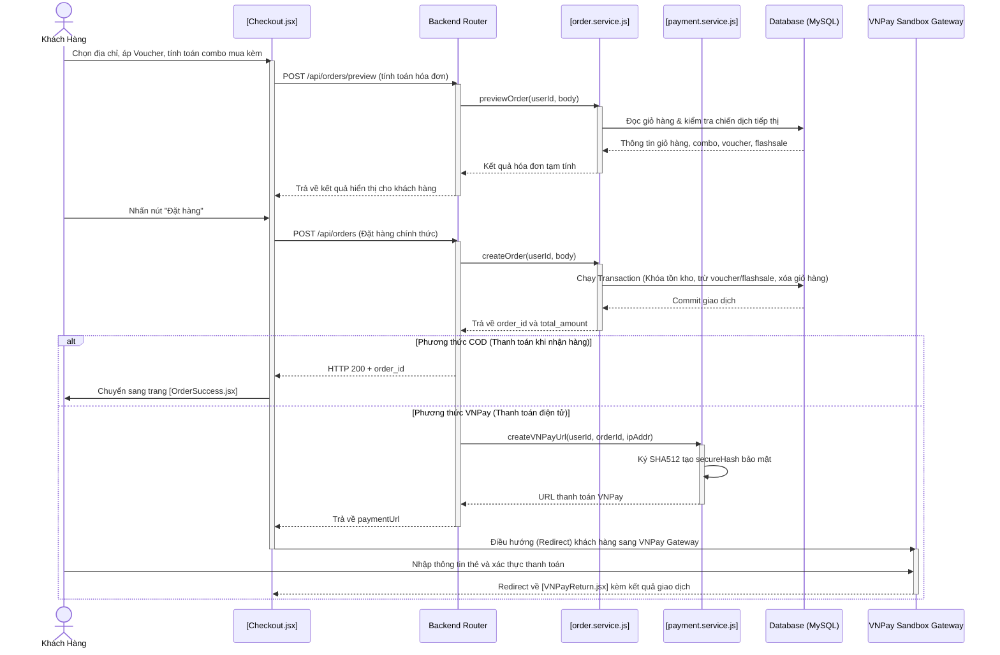

# 📦 TÀI LIỆU QUY TRÌNH HỆ THỐNG SHOES STORE: GIAO DỊCH, THANH TOÁN, TIẾP THỊ, BẢO MẬT & CHĂM SÓC KHÁCH HÀNG

Tài liệu này mô tả toàn diện, chi tiết và bám sát mã nguồn thực tế của dự án **Shoes Store**, cung cấp kịch bản hoạt động và cách triển khai kỹ thuật của 5 phân hệ cốt lõi trong hệ thống: **Giao dịch (Đặt hàng)**, **Thanh toán (COD & VNPay)**, **Tiếp thị & Khuyến mại**, **Bảo mật Hệ thống** và **Chăm sóc Khách hàng**.

---

## 🗺️ 1. Sơ đồ Hoạt động Tổng quan (System Overview Flow)



---

## ⚙️ 2. Quy trình Giao dịch (Transaction Flow)

Quy trình giao dịch được phân tách thành hai giai đoạn cốt lõi: **Preview (Xem trước hóa đơn)** và **Create Order (Đặt hàng chính thức)**.

### 1. Xem trước hóa đơn (Order Preview)
*   **API Endpoint:** `POST /api/orders/preview`
*   **Controller:** [order.controller.js](file:///d:/giphub/ISC301_SU26/backend/src/modules/order/order.controller.js)
*   **Service:** Hàm [previewOrder](file:///d:/giphub/ISC301_SU26/backend/src/modules/order/order.service.js#L17)
*   **Mục đích:** Giúp khách hàng cập nhật số tiền phải trả tức thời khi thay đổi địa chỉ nhận hàng, áp dụng Voucher, hoặc chọn/xóa sản phẩm mua kèm.
*   **Luồng xử lý:**
    1.  **Lấy giỏ hàng:** Đọc toàn bộ các mặt hàng trong giỏ hàng hiện tại của khách hàng cùng thông tin kích cỡ, màu sắc và danh mục.
    2.  **Cập nhật giá Flash Sale:** Kiểm tra sản phẩm có thuộc chương trình Flash Sale đang hoạt động hay không. Nếu có, ghi đè giá bán thường bằng giá Flash Sale (`flash_price`) và giới hạn tồn kho dựa trên quỹ hàng Flash Sale còn lại.
    3.  **Tính toán Ưu đãi Combo (Cross-Sell / Combo Discount):** Gọi hàm tiện ích `applyComboDiscount` tại [combo.util.js](file:///d:/giphub/ISC301_SU26/backend/src/utils/combo.util.js) để:
        *   Giảm **20%** cho phụ kiện khi mua kèm giày (is_bought_together = 1).
        *   Giảm **15%** cho toàn bộ combo 3 món (1 Giày + 1 Tất + 1 Dây giày) cùng thương hiệu hoặc phối màu.
    4.  **Tính Phí vận chuyển (Shipping Fee):**
        *   Dựa trên hàm `calculateShippingFee`: TP. HCM là 25.000₫, Hà Nội là 30.000₫, các tỉnh khác là 45.000₫.
        *   **Miễn phí vận chuyển (Free Ship):** Tự động áp dụng nếu tổng giá trị đơn hàng tạm tính (subtotal) từ **500.000₫** trở lên.
    5.  **Áp dụng mã giảm giá (Voucher):** Nếu có `voucher_code`, gọi `voucherService.applyVoucher` kiểm tra tính hợp lệ và tính số tiền giảm giá.
    6.  **Trả về kết quả tạm tính:** Trả về dữ liệu hóa đơn chi tiết cho Frontend [Checkout.jsx](file:///d:/giphub/ISC301_SU26/frontend/src/pages/Checkout.jsx) hiển thị.

### 2. Đặt hàng chính thức (Order Creation)
*   **API Endpoint:** `POST /api/orders`
*   **Service:** Hàm [createOrder](file:///d:/giphub/ISC301_SU26/backend/src/modules/order/order.service.js#L113)
*   **Tính nhất quán dữ liệu (MySQL Transaction):** Mọi thao tác được bọc trong một MySQL Transaction. Nếu có bất kỳ lỗi nào (ví dụ: mất kết nối, sản phẩm hết hàng đột ngột, lỗi logic), hệ thống sẽ gọi `rollback()` để khôi phục trạng thái ban đầu của CSDL:
    1.  **Kiểm tra tồn kho thực tế:** Duyệt qua từng sản phẩm, nếu số lượng yêu cầu lớn hơn tồn kho thực tế (`stock_quantity < quantity`), hệ thống sẽ hủy quy trình tạo đơn và phản hồi lỗi 400.
    2.  **Khóa & Cập nhật số lượng Flash Sale:** Nếu sản phẩm thuộc Flash Sale, hệ thống chạy truy vấn có khóa dòng `FOR UPDATE` để ngăn chặn các tiến trình đặt hàng song song khác tranh chấp số lượng. Đồng thời, tăng `sold_quantity` trong bảng `flash_sale_items`.
    3.  **Ghi nhận dữ liệu đơn hàng:**
        *   Thêm bản ghi đơn hàng vào bảng `orders` kèm snapshot thông tin địa chỉ giao hàng (`shipping_address`).
        *   Thêm chi tiết các mặt hàng vào bảng `order_items`, lưu lại giá bán thực tế tại thời điểm mua (`price_at_purchase`).
    4.  **Cập nhật Voucher:** Tăng số lượng đã dùng của Voucher (`used_count = used_count + 1`).
    5.  **Dọn dẹp giỏ hàng:** Xoá toàn bộ sản phẩm trong bảng `cart_items` của khách hàng.
    6.  **Khởi tạo bản ghi thanh toán:** Thêm bản ghi vào bảng `payments` với trạng thái ban đầu là `pending`.
    7.  **Gửi email xác nhận:** Với đơn COD, gửi email tự động xác nhận đơn hàng thành công qua Nodemailer.

---

## 💳 3. Quy trình Thanh toán (Payment Flow)

### A. Phương thức COD (Thanh toán khi nhận hàng)
1. Đơn hàng được tạo với trạng thái `status = 'pending'` và `payment_status = 'unpaid'`.
2. Admin duyệt đơn hàng sang `confirmed` (Hệ thống tự động trừ kho sản phẩm).
3. Đơn hàng được vận chuyển và giao thành công. Admin cập nhật trạng thái đơn hàng thành `delivered`:
    * Hệ thống tự động chuyển trạng thái đơn hàng sang `delivered`.
    * Tự động cập nhật `payment_status = 'paid'` trong bảng `orders`.
    * Tự động cập nhật trạng thái giao dịch trong bảng `payments` thành `success` qua hàm [updateOrderStatusByAdmin](file:///d:/giphub/ISC301_SU26/backend/src/modules/order/order.service.js#L432).

### B. Phương thức VNPay (Thanh toán trực tuyến)
Luồng tích hợp cổng thanh toán VNPay Sandbox được triển khai khép kín qua 3 giai đoạn:

#### Giai đoạn 1: Khởi tạo URL Thanh toán (Create Payment URL)
* Sau khi tạo đơn hàng VNPay thành công, Frontend gọi API `POST /api/payment/vnpay-url`.
* Backend gọi hàm [createVNPayUrl](file:///d:/giphub/ISC301_SU26/backend/src/modules/payment/payment.service.js#L43) để:
    1. Chuẩn hóa địa chỉ IP của client (chuyển IPv6 localhost `::1` sang IPv4 `127.0.0.1` để tránh VNPay từ chối).
    2. Gom các tham số kết nối bắt buộc (`vnp_Version`, `vnp_Command`, `vnp_TmnCode`, `vnp_Amount`, `vnp_TxnRef`, v.v.).
    3. Sắp xếp các tham số theo bảng chữ cái alphabet và mã hóa URL thông qua hàm `sortObject`.
    4. Ký bảo mật HMAC-SHA512 với khóa bí mật `VNP_HASH_SECRET` để sinh ra chữ ký số bảo mật `vnp_SecureHash`.
    5. Trả về liên kết thanh toán hoàn chỉnh. Frontend thực hiện chuyển hướng khách hàng sang cổng VNPay.

#### Giai đoạn 2: Xác thực giao dịch tại Client (Return URL Handler)
* Khách hàng thanh toán thành công/thất bại trên VNPay Gateway sẽ được chuyển hướng về trang Frontend được thiết lập tại `VNP_RETURN_URL` (Trang [VNPayReturn.jsx](file:///d:/giphub/ISC301_SU26/frontend/src/pages/VNPayReturn.jsx)).
* [VNPayReturn.jsx](file:///d:/giphub/ISC301_SU26/frontend/src/pages/VNPayReturn.jsx) thu thập các tham số truy vấn trên URL và gửi yêu cầu xác thực qua API `GET /api/payment/vnpay-verify`.
* Backend gọi hàm [verifyVNPayReturn](file:///d:/giphub/ISC301_SU26/backend/src/modules/payment/payment.service.js#L109) để:
    1. Kiểm tra tính toàn vẹn của dữ liệu bằng cách tính lại chữ ký SHA512 và so sánh với `vnp_SecureHash` gửi kèm.
    2. Nếu chữ ký hợp lệ và mã phản hồi giao dịch `vnp_ResponseCode === '00'` (Thành công):
        * Cập nhật trạng thái đơn hàng sang `payment_status = 'paid'` và `status = 'confirmed'`.
        * **Trừ kho sản phẩm biến thể** (`stock_quantity`) và **tăng lượt bán** (`sold_count`).
        * Cập nhật thông tin giao dịch trong bảng `payments` (`status = 'success'`, mã giao dịch VNPay `transaction_id`).
        * Gửi email HTML xác nhận đơn hàng kèm hóa đơn chi tiết đến email khách hàng.
    3. Nếu giao dịch thất bại, thông báo lỗi được hiển thị trên giao diện và cho phép khách hàng thử lại.

#### Giai đoạn 3: Xác thực Webhook Server-to-Server (IPN Callback)
* Phòng trường hợp người dùng đóng trình duyệt trước khi Redirect về trang Return URL, VNPay Server sẽ gọi trực tiếp vào API Webhook của backend `GET /api/payment/vnpay-ipn`.
* Backend gọi hàm [handleVNPayIPN](file:///d:/giphub/ISC301_SU26/backend/src/modules/payment/payment.service.js#L236) chạy độc lập:
    1. Kiểm tra chữ ký bảo mật checksum.
    2. Đối chiếu số tiền thực trả từ VNPay với giá trị thực tế của đơn hàng trong DB để tránh gian lận số tiền.
    3. Đảm bảo trạng thái đơn hàng chưa được xác nhận trước đó (tránh cập nhật trùng lặp).
    4. Cập nhật cơ sở dữ liệu trong Transaction, trừ kho sản phẩm và gửi mail xác nhận tương tự giai đoạn Return URL.
    5. Trả về mã phản hồi JSON chuẩn (ví dụ: `{"RspCode":"00","Message":"Confirm success"}`) cho VNPay Server.

---

## 📣 4. Quy trình Tiếp thị & Quảng cáo (Marketing & Advertising)

Hệ thống tích hợp 4 kênh tiếp thị và quảng cáo chính giúp tăng trưởng doanh thu và thu hút khách hàng:

```text
               ┌────────────────────────────────────────────────────────┐
               │              TIẾP THỊ & KHUYẾN MẠI                     │
               └────────────────────────────────────────────────────────┘
                   │                 │                  │               │
                   ▼                 ▼                  ▼               ▼
            [1. Flash Sales]    [2. Vouchers]     [3. Combo Sales]  [4. Banners]
            - Countdown thực    - Chiết khấu %    - Giảm 20% phụ    - Slider QC
            - Lock FOR UPDATE   - Check min-order   kiện kèm giày     trang chủ
            - Quỹ hàng riêng    - Giới hạn lượt   - Giảm 15% trọn
                                  sử dụng           bộ giày+vớ+dây
```

### 1. Chương trình Flash Sale (Flash Sales)
*   **Mô tả:** Tạo ra các chương trình kích cầu mua sắm trong một khoảng thời gian giới hạn với giá ưu đãi cực lớn.
*   **Quản lý (Admin):** Admin có thể tạo chiến dịch Flash Sale tại [Flashsales.jsx](file:///d:/giphub/ISC301_SU26/frontend/src/pages/admin/Flashsales.jsx), thiết lập thời gian bắt đầu, kết thúc, số lượng sản phẩm mở bán và giá Flash Sale.
*   **Hiển thị (Khách hàng):** Hiển thị bộ đếm ngược thời gian thực (Countdown) trên trang chi tiết sản phẩm để tạo sự khẩn trương.
*   **Cơ chế chống vượt hạn mức:** Khi đặt hàng, backend áp dụng khóa dòng (`FOR UPDATE`) trên bảng dữ liệu để kiểm tra tồn kho Flash Sale còn lại trước khi trừ kho nhằm đảm bảo không bán vượt mức số lượng mở bán đã cam kết.

### 2. Ưu đãi Combo (Cross-Selling & Combo Discounts)
Thuật toán ghép cặp ưu đãi combo được thực hiện tự động trong hàm [applyComboDiscount](file:///d:/giphub/ISC301_SU26/backend/src/utils/combo.util.js#L7):
*   **Combo mua kèm phụ kiện (Giảm 20%):** Khi trong giỏ hàng có ít nhất một sản phẩm Giày, các phụ kiện đi kèm (tất, dây giày, chai xịt vệ sinh...) được đánh dấu mua kèm (`is_bought_together = 1`) sẽ tự động được chiết khấu **giảm giá 20%**.
*   **Combo 3 món hoàn chỉnh (Giảm 15% toàn bộ):** Khi hệ thống phát hiện combo chứa **1 Giày + 1 Tất + 1 Dây giày** cùng thương hiệu hoặc phối màu, hệ thống tự động giảm giá **15% trên tổng giá trị của cả 3 món**.
*   **Ràng buộc:** Nếu phụ kiện được mua lẻ từ trang chủ hoặc không đi kèm giày, giá bán sẽ giữ nguyên giá gốc ban đầu.

### 3. Mã giảm giá (Voucher Discounts)
*   **Định nghĩa:** Hệ thống cho phép cấu hình các mã Voucher giảm giá theo số tiền cố định (ví dụ: giảm 50.000₫) hoặc theo tỷ lệ phần trăm (ví dụ: giảm 10% tối đa 100.000₫).
*   **Ràng buộc sử dụng:**
    *   Kiểm tra giá trị đơn hàng tối thiểu (`min_order_value`).
    *   Kiểm tra ngày hiệu lực (`start_date`, `end_date`).
    *   Giới hạn tổng số lượt sử dụng của Voucher (`limit_usage`) và số lần sử dụng của mỗi khách hàng.
*   **Triển khai kỹ thuật:** Dịch vụ kiểm tra và áp dụng voucher được xử lý đồng bộ ở [voucher.service.js](file:///d:/giphub/ISC301_SU26/backend/src/modules/order/order.service.js#L91).

### 4. Hệ thống Banner Quảng cáo (Home Banner Slider)
*   **Mô tả:** Hỗ trợ trình diễn các chương trình khuyến mại, sản phẩm mới nổi bật thông qua slider banner lớn tại trang chủ.
*   **Kỹ thuật:** Admin tải ảnh banner lên máy chủ và thiết lập các liên kết điều hướng (ví dụ: dẫn đến bộ sưu tập Nike, trang Flash Sale...). Các banner được phục vụ thông qua API tại thư mục [banner](file:///d:/giphub/ISC301_SU26/backend/src/modules/banner).

---

## 🔒 5. Bảo mật Hệ thống (System Security)

Ứng dụng Shoes Store triển khai nhiều lớp bảo mật từ xác thực người dùng đến phòng chống các lỗ hổng bảo mật phổ biến:

```text
[Khách Hàng Request]
        │
        ├──► [Mã hóa Bcrypt]      --> Mã hóa băm 1 chiều mật khẩu người dùng
        ├──► [Xác thực OTP Email] --> Chặn đăng ký email ảo/spam tài khoản
        ├──► [JWT verifyToken]    --> Xác thực Stateless phiên làm việc (7 ngày)
        ├──► [RBAC requireRole]   --> Phân quyền nghiêm ngặt Admin và Customer
        ├──► [Joi Validation]     --> Validate kiểu dữ liệu đầu vào chống dữ liệu rác
        ├──► [Parameterized SQL]  --> Ngăn chặn triệt để lỗ hổng SQL Injection
        └──► [Transaction Rollback] -> Chống tranh chấp trạng thái dữ liệu (Race Conditions)
```

### 1. Mã hóa mật khẩu an toàn (Bcrypt Hashing)
*   Mật khẩu của người dùng khi đăng ký tài khoản không bao giờ lưu dưới dạng văn bản thô (Plaintext).
*   Hệ thống sử dụng thư viện `bcryptjs` để thực hiện băm mật khẩu với độ muối (salt rounds) phù hợp trước khi lưu trữ vào cột `password_hash` của bảng `users`. Quá trình đăng nhập sử dụng `bcrypt.compare` để đối chiếu an toàn.

### 2. Xác thực và Phân quyền (JWT & RBAC)
*   **Xác thực qua JWT:** Phiên làm việc của người dùng được quản lý bằng JWT Token (Stateless). Token được ký bằng mã bí mật `JWT_SECRET` với thời hạn hết hạn 7 ngày. Middleware [verifyToken](file:///d:/giphub/ISC301_SU26/backend/src/middlewares/auth.middleware.js#L5) chặn lọc tất cả các request yêu cầu xác thực, giải mã và gán thông tin định danh vào `req.user`.
*   **Phân quyền (Role-based Access Control):** Các chức năng quản trị được bảo vệ nghiêm ngặt bằng middleware phân quyền. Ví dụ, chỉ những tài khoản có vai trò `admin` mới được đi qua bộ lọc `requireRole('admin')` để truy cập các API thêm, sửa, xóa sản phẩm, thương hiệu hoặc đơn hàng.

### 3. Cơ chế đăng ký xác thực qua mã OTP Email
*   Để chống spam tài khoản và đảm bảo thông tin email của khách hàng là có thật, quy trình đăng ký bắt buộc khách hàng nhập mã OTP 6 số được gửi qua hòm thư cá nhân.
*   **Triển khai:** Khi khách hàng đăng ký, thông tin thô được lưu tạm tại bảng `otp_pending` cùng mã OTP đã băm. Chỉ khi nhập đúng OTP trong vòng 5 phút, tài khoản mới được chuyển sang bảng `users` chính thức. Các bản ghi OTP hết hạn sẽ tự động bị xóa định kỳ mỗi 10 phút bằng một Cron Job chạy ngầm (`otp.cleanup.job.js`).

### 4. Ngăn chặn SQL Injection & Bảo đảm tính nhất quán giao dịch
*   **Parameterized Queries:** Toàn bộ truy vấn SQL tương tác với CSDL MySQL được thực thi thông qua cơ chế tham số hóa dữ liệu (Prepared Statements) của driver `mysql2` trong cấu hình [db.js](file:///d:/giphub/ISC301_SU26/backend/src/config/db.js). Điều này ngăn chặn hoàn toàn nguy cơ chèn mã SQL Injection từ phía người dùng.
*   **Database Transaction:** Đối với các tác vụ nhạy cảm liên quan đến dòng tiền và số lượng kho (như đặt hàng, trừ kho, thanh toán thành công), hệ thống bắt buộc sử dụng cơ chế Transaction để thực thi đồng bộ hoặc hủy bỏ hoàn toàn (`rollback`), tránh tình trạng lỗi bất ngờ dẫn đến sai lệch kho hàng.

### 5. Bộ lọc tải tệp an toàn (Multer Validation & Error Wrapper)
*   Khi Admin tải lên hình ảnh cho Danh mục, Thương hiệu hay Sản phẩm, middleware Multer giới hạn kích thước tệp tối đa là **2MB** và chỉ cho phép định dạng ảnh hợp lệ (JPG, JPEG, PNG, WEBP).
*   Middleware [handleUploadError](file:///d:/giphub/ISC301_SU26/backend/src/middlewares/upload.middleware.js) bọc ngoài Multer để bắt và chuyển đổi các lỗi tải tệp thành định dạng JSON phản hồi đồng bộ, ngăn ngừa máy chủ bị treo hoặc crash khi người dùng tải tệp độc hại hoặc quá kích thước.

---

## 🤝 6. Chăm sóc Khách hàng (Customer Service)

Shoes Store chú trọng nâng cao trải nghiệm mua sắm thông qua các tính năng hỗ trợ và tương tác thông minh:

### 1. Trợ lý Tư vấn AI (AI Assistant)
*   **Mô tả:** Một hộp thoại chat thông minh được tích hợp trực tiếp tại giao diện. Khách hàng có thể đặt các câu hỏi tự nhiên như *"Tôi muốn tìm một đôi giày chạy bộ tầm giá dưới 2 triệu"*, *"Màu nào hợp với nam giới?"*.
*   **Kỹ thuật:** Giao diện [AiAssistant.jsx](file:///d:/giphub/ISC301_SU26/frontend/src/pages/AiAssistant.jsx) kết nối trực tiếp với API trí tuệ nhân tạo ở backend để phân tích ý định người dùng và đưa ra gợi ý sản phẩm phù hợp thời gian thực.

### 2. Đo Kích cỡ chân thông minh (AI Foot Measurement)
*   **Mô tả:** Giúp khách hàng giải quyết nỗi lo chọn sai size giày khi mua sắm trực tuyến.
*   **Hoạt động:** Khách hàng chụp ảnh bàn chân đặt cạnh một vật thể tham chiếu tiêu chuẩn (ví dụ: thẻ ATM hoặc tờ giấy A4) rồi tải lên hệ thống tại [AiFootMeasure.jsx](file:///d:/giphub/ISC301_SU26/frontend/src/pages/AiFootMeasure.jsx). Trợ lý AI sẽ tính toán tỷ lệ, phân tích chiều dài và độ rộng bàn chân để đề xuất size giày chuẩn xác nhất kèm cảnh báo độ ôm của phom giày.

### 3. Trung tâm Hỗ trợ & Trò chuyện trực tuyến (Support Ticket/Chat)
*   **Hoạt động:** Khách hàng có thể gửi yêu cầu trợ giúp trực tiếp thông qua form liên hệ.
*   **Backend xử lý:** Dịch vụ tại [support.service.js](file:///d:/giphub/ISC301_SU26/backend/src/modules/support/support.service.js) sẽ:
    *   Lưu trữ các thông điệp trợ giúp vào bảng `support_messages` đi kèm với một mã phiên duy nhất (`session_id`).
    *   Phân loại vai trò người gửi (`sender_type` là `customer` hoặc `admin`).
    *   Cung cấp API `getActiveThreads` cho Admin để lọc ra các phiên trò chuyện đang hoạt động và tiến hành phản hồi tư vấn.

### 4. Hệ thống Đánh giá & Phản hồi chất lượng (Reviews & Ratings)
*   **Mô tả:** Cho phép khách hàng để lại đánh giá từ 1 đến 5 sao kèm nhận xét chi tiết và hình ảnh thực tế sau khi nhận được hàng.
*   **Nhãn xác thực (Verified Buyer):** Hệ thống chỉ hiển thị nhãn "Đã mua hàng" đối với những tài khoản thực sự đã hoàn thành đơn hàng có chứa sản phẩm đó, tăng tính minh bạch và độ tin cậy của đánh giá sản phẩm.

### 5. Email chăm sóc và thông báo giao dịch tự động
*   Ngay khi hoàn tất đặt hàng thành công (COD) hoặc thanh toán hoàn tất (VNPay), hệ thống tự động soạn thảo email gửi hóa đơn điện tử chi tiết bao gồm danh sách sản phẩm, địa chỉ giao hàng, phí vận chuyển và số tiền thanh toán thông qua SMTP Nodemailer, giúp khách hàng lưu trữ và theo dõi thông tin dễ dàng.

---

## 📂 7. Cập nhật Danh sách các File liên quan đến Hệ thống

### Frontend (Giao diện)
*   🛒 Thanh toán đơn hàng: [Checkout.jsx](file:///d:/giphub/ISC301_SU26/frontend/src/pages/Checkout.jsx)
*   💳 Đón nhận kết quả VNPay: [VNPayReturn.jsx](file:///d:/giphub/ISC301_SU26/frontend/src/pages/VNPayReturn.jsx)
*   🤖 Giao diện Trợ lý chat AI: [AiAssistant.jsx](file:///d:/giphub/ISC301_SU26/frontend/src/pages/AiAssistant.jsx)
*   📸 Giao diện Đo size chân AI: [AiFootMeasure.jsx](file:///d:/giphub/ISC301_SU26/frontend/src/pages/AiFootMeasure.jsx)
*   ⚙️ Quản lý Flash Sale (Admin): [Flashsales.jsx](file:///d:/giphub/ISC301_SU26/frontend/src/pages/admin/Flashsales.jsx)

### Backend (Xử lý nghiệp vụ & Bảo mật)
*   🛠️ Xử lý Đơn hàng & Kho hàng: [order.service.js](file:///d:/giphub/ISC301_SU26/backend/src/modules/order/order.service.js)
*   🛠️ Xử lý Tích hợp VNPay & IPN: [payment.service.js](file:///d:/giphub/ISC301_SU26/backend/src/modules/payment/payment.service.js)
*   🛠️ Tính toán Combo ưu đãi: [combo.util.js](file:///d:/giphub/ISC301_SU26/backend/src/utils/combo.util.js)
*   🛠️ Quản lý Tin nhắn Hỗ trợ: [support.service.js](file:///d:/giphub/ISC301_SU26/backend/src/modules/support/support.service.js)
*   🛡️ Middleware Xác thực phiên JWT: [auth.middleware.js](file:///d:/giphub/ISC301_SU26/backend/src/middlewares/auth.middleware.js)
*   🛡️ Middleware Phân quyền Admin: [role.middleware.js](file:///d:/giphub/ISC301_SU26/backend/src/middlewares/role.middleware.js) (nằm trong thư mục middlewares)
*   🛡️ Middleware Chống lỗi tải tệp: [upload.middleware.js](file:///d:/giphub/ISC301_SU26/backend/src/middlewares/upload.middleware.js) (nằm trong thư mục middlewares)
*   🛡️ Kết nối CSDL & Chống Injection: [db.js](file:///d:/giphub/ISC301_SU26/backend/src/config/db.js)
