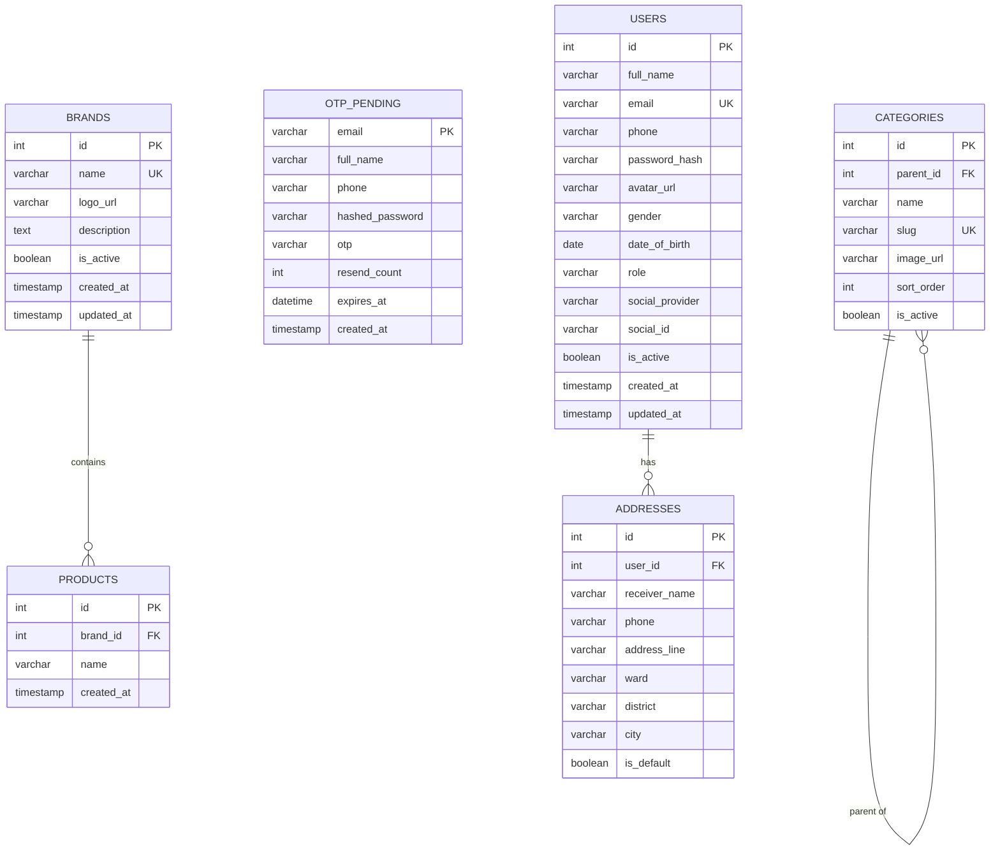
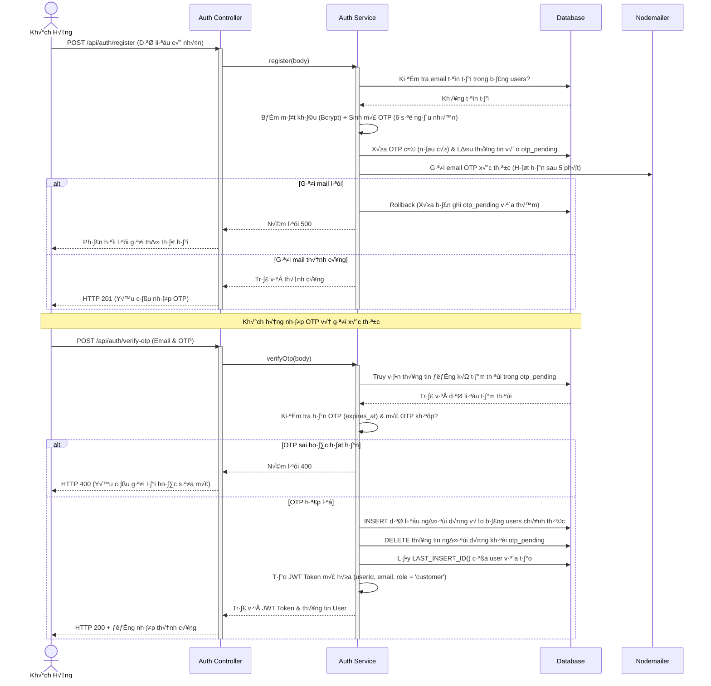
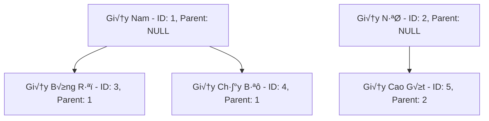

# Shoes Store Backend - Tài liệu Kiến trúc & Luồng nghiệp vụ API

Dự án Backend cung cấp các dịch vụ API cho hệ thống cửa hàng bán giày (Shoes Store), được phát triển bằng **Node.js, Express.js và cơ sở dữ liệu MySQL**.

---

## 1. Công nghệ Sử dụng (Tech Stack)

*   **Core Framework:** [Express.js](https://expressjs.com/) (v4.19.2) - Framework Node.js tối giản, linh hoạt.
*   **Database:** [MySQL](https://www.mysql.com/) kết nối qua driver `mysql2` hỗ trợ Promise pooling.
*   **Authentication & Security:** 
    *   [JSON Web Token (JWT)](https://jwt.io/) để xác thực người dùng (Stateless sessions).
    *   [BcryptJS](https://github.com/dcodeIO/bcrypt.js) mã hóa (băm) mật khẩu người dùng trước khi lưu vào database.
    *   [Google Auth Library](https://github.com/googleapis/google-auth-library-nodejs) để xác thực qua mạng xã hội Google OAuth2 (Google Sign-In).
*   **Validation:** [Joi](https://joi.dev/) để kiểm tra tính hợp lệ của dữ liệu đầu vào.
*   **File Upload:** [Multer](https://github.com/expressjs/multer) để xử lý dữ liệu form-data và lưu trữ file cục bộ (avatar, logo, category image).
*   **Background Jobs:** [Node-cron](https://github.com/node-cron/node-cron) để lập lịch dọn dẹp dữ liệu OTP tạm thời.
*   **Mailing:** [Nodemailer](https://nodemailer.com/) gửi email chứa OTP để xác thực tài khoản.
*   **API Specification:** Swagger (OpenAPI 3.0) được lưu ở tệp `docs/api/openapi_spec.yaml` và cấu hình trực quan qua đường dẫn `/swagger`.

---

## 2. Cấu trúc Thư mục Backend

Mã nguồn Backend được tổ chức theo cấu trúc dạng **Module-based** giúp dễ dàng quản lý, mở rộng và bảo trì:

```text
ISC301_SU26/
+-- README.md                  # Project entrypoint and documentation index
+-- Dockerfile                 # Backend image definition
+-- docker-compose.yml         # Local app + MySQL stack
+-- docs/                      # Project documentation
¶   +-- api/                   # OpenAPI, Apidog JSON, and API reference
¶   +-- backend/               # Backend conventions
¶   +-- frontend/              # Frontend conventions
¶   +-- infra/                 # Docker and deployment notes
+-- frontend/                  # React/Vite frontend source
+-- infra/
¶   +-- mysql/init.sql         # Schema and seed data for MySQL
+-- backend/                   # Backend package, source, tests, and built public assets
+-- backend/src/               # Backend runtime source
+-- tests/                     # Node test suite
+-- tools/                     # Developer utilities and scratch scripts
```

Mỗi module nghiệp vụ (trong thư mục `backend/src/modules/`) được cấu trúc khép kín bao gồm:
*   `*.routes.js`: Định nghĩa các endpoints, áp dụng các middleware tương ứng (Auth, Role, Upload, Validation).
*   `*.validation.js`: Khai báo cấu trúc Joi schema dùng để validate dữ liệu đầu vào của request.
*   `*.controller.js`: Tiếp nhận request, tách lọc dữ liệu, gọi tầng Service và phản hồi kết quả về client.
*   `*.service.js`: Chứa toàn bộ logic nghiệp vụ thực tế và trực tiếp tương tác với cơ sở dữ liệu qua các hàm truy vấn SQL.

---

## 3. Kiến trúc Cơ sở dữ liệu (Database Schema)

Dựa trên cấu trúc tệp [init.sql](file:///d:/giphub/ISC301_SU26/infra/mysql/init.sql), cơ sở dữ liệu bao gồm các bảng chính sau:



### Chi ti·∫øt c√°c b·∫£ng:
1.  **`users`**: Lưu trữ thông tin tài khoản người dùng chính thức bao gồm cả tài khoản thường và tài khoản mạng xã hội (`social_provider = 'google'`). Cột `role` lưu vai trò truy cập (`admin` hoặc `customer`).
2.  **`otp_pending`**: Lưu thông tin đăng ký tạm thời của người dùng. Khi người dùng hoàn tất xác minh OTP, thông tin từ đây mới được chuyển sang bảng `users` chính thức và xóa khỏi bảng này.
3.  **`categories`**: Lưu danh mục sản phẩm hỗ trợ phân cấp cha - con 2 tầng. Cột `parent_id` tự liên kết tới khóa chính `id` của chính nó. Cấu hình tự động `ON DELETE SET NULL` khi danh mục cha bị xóa.
4.  **`brands`**: Lưu danh sách các thương hiệu giày (ví dụ: Nike, Adidas).
5.  **`products`**: Thực thể liên kết sản phẩm với thương hiệu thông qua `brand_id`.
6.  **`addresses`**: Lưu danh sách địa chỉ giao hàng của người dùng. Mỗi người dùng có tối đa một địa chỉ mặc định (`is_default = true`).

---

## 4. Mô tả Luồng Nghiệp vụ Nghiệp vụ chính

### A. Luồng Đăng ký Tài khoản & Xác thực OTP (OTP Signup Flow)

Mục đích nhằm tránh việc đăng ký bằng email ảo, đảm bảo tất cả email khách hàng trong hệ thống đều tồn tại thực tế.



#### Quy tắc nghiệp vụ bổ sung (Rules):
*   **Gửi lại OTP (`POST /api/auth/resend-otp`):** Cho phép người dùng gửi lại mã OTP tối đa 3 lần (`resend_count` tăng dần). Vượt quá 3 lần sẽ chặn và bắt buộc người dùng thực hiện đăng ký lại từ đầu. Mỗi lần gửi lại sẽ tự sinh OTP mới và gia hạn thêm 5 phút.
*   **Cron Job Dọn dẹp (`otp.cleanup.job.js`):** Để tránh đầy rác bộ nhớ bảng `otp_pending` đối với những tài khoản không hoàn tất xác thực, một cron job chạy tự động định kỳ **mỗi 10 phút** thực hiện tác vụ:
    ```sql
    DELETE FROM otp_pending WHERE expires_at < NOW()
    ```

---

### B. Luồng Đăng nhập Hệ thống (Login & Google OAuth)

Hệ thống hỗ trợ 2 hình thức đăng nhập: Đăng nhập truyền thống (Email/Password) và Đăng nhập nhanh qua Google (OAuth2).

#### 1. Đăng nhập Truyền thống:
1.  Người dùng gửi `email` và `password` lên endpoint `POST /api/auth/login`.
2.  Hệ thống kiểm tra tài khoản theo email:
    *   Tài khoản không tồn tại hoặc bị khóa (`is_active = false`) -> Phản hồi từ chối đăng nhập.
    *   Tài khoản được đăng ký qua Google nhưng chưa bao giờ thiết lập mật khẩu hệ thống (`password_hash IS NULL`) -> Yêu cầu người dùng đăng nhập bằng phương thức Google.
3.  Hệ thống tiến hành đối chiếu so sánh mật khẩu gửi lên với mật khẩu băm trong database qua `bcrypt.compare`.
4.  Nếu khớp, hệ thống ký JWT Token thời hạn mặc định là 7 ngày chứa thông tin phân quyền và gửi phản hồi.

#### 2. Đăng nhập qua Google (OAuth2):
1.  Client gửi chuỗi xác thực `credential` (ID Token được Google cấp sau khi chọn tài khoản trên giao diện) lên `POST /api/auth/google`.
2.  Backend sử dụng thư viện `google-auth-library` để verify tính toàn vẹn và hợp lệ của ID Token với Google.
3.  Sau khi lấy payload dữ liệu người dùng từ Google, hệ thống kiểm tra email:
    *   **Trường hợp chưa có tài khoản:** Tạo mới một bản ghi trong bảng `users` với `social_provider = 'google'`, `social_id = googleSub`, `password_hash = NULL`, mặc định kích hoạt tài khoản và gán vai trò `customer`.
    *   **Trường hợp đã có tài khoản thường (đăng ký bằng email thường):** Tiến hành liên kết tài khoản bằng cách cập nhật `social_provider = 'google'` và điền `social_id` vào thông tin người dùng.
4.  Hệ thống ký và cấp phát JWT Token truy cập tương tự luồng đăng nhập thường.

---

### C. Luồng Quản lý Địa chỉ Giao hàng (Addresses Management)

Quản lý thông tin giao hàng của người dùng, tích hợp cơ chế tự động quản lý địa chỉ mặc định (`is_default`).

#### Quy tắc nghiệp vụ mặc định:
*   **Khi tạo địa chỉ mới:** Nếu đây là địa chỉ **đầu tiên** của người dùng (`COUNT(addresses) = 0`), nó sẽ tự động được đặt làm địa chỉ mặc định (`is_default = true`). Các địa chỉ tiếp theo sẽ mặc định là không (`is_default = false`).
*   **Khi thiết lập mặc định (`PUT /api/addresses/:id/default`):** Để đảm bảo chỉ có duy nhất một địa chỉ mặc định tại một thời điểm, hệ thống chạy một **Database Transaction** tuần tự:
    ```sql
    UPDATE addresses SET is_default = false WHERE user_id = ?;
    UPDATE addresses SET is_default = true WHERE id = ? AND user_id = ?;
    ```
*   **Khi xóa địa chỉ mặc định:** Nếu người dùng xóa địa chỉ đang là mặc định, hệ thống sẽ tự động tìm kiếm địa chỉ gần nhất còn lại của họ (dựa trên ID lớn nhất) và cập nhật nó thành địa chỉ mặc định để tránh việc tài khoản bị trống địa chỉ mặc định.

---

### D. Phân hệ Admin: Quản lý Danh mục 2 Tầng (Admin Category Management)

Danh mục sản phẩm được quản lý chặt chẽ để hiển thị cấu trúc dạng cây phân cấp trực quan lên Frontend.



#### Các quy tắc ràng buộc chặt chẽ của Danh mục (Business Rules):
1.  **Giới hạn cấu trúc 2 tầng:** Cột `parent_id` của danh mục cha luôn bằng `NULL`. Danh mục con trỏ `parent_id` về danh mục cha. Hệ thống kiểm tra: nếu danh mục cha được chọn có `parent_id !== NULL` (tức là bản thân nó là danh mục con), hệ thống sẽ từ chối tạo/cập nhật vì vượt quá giới hạn 2 tầng.
2.  **Tự động tạo Slug độc nhất:** Sử dụng hàm tiện ích `toSlug()` để chuyển tên tiếng Việt thành slug không dấu. Nếu slug trùng lặp với danh mục đã có, hệ thống tự động tăng hậu tố (ví dụ: `giay-nike`, `giay-nike-2`, `giay-nike-3`...) để đảm bảo đường dẫn tĩnh luôn là duy nhất.
3.  **Hủy kích hoạt dạng Cascade:** Khi Admin ẩn danh mục cha (`is_active` đổi sang `false`), hệ thống tự động cập nhật ẩn toàn bộ danh mục con trực thuộc của nó:
    ```sql
    UPDATE categories SET is_active = false WHERE parent_id = ?
    ```
4.  **Ràng buộc logic khi sửa cấp độ cha-con:**
    *   Danh mục không thể được gán làm cha của chính nó (`parent_id !== id`).
    *   Nếu một danh mục đang đóng vai trò là cha của các danh mục khác, nó sẽ bị chặn không cho phép cập nhật đổi `parent_id` thành một danh mục khác (tránh việc danh mục con bị kéo xuống thành cấp 3 hoặc bị mồ côi).
5.  **Dọn dẹp tài nguyên tệp cũ:** Khi cập nhật ảnh biểu tượng mới cho danh mục, hệ thống sẽ tự động kiểm tra và xóa tệp ảnh cũ lưu trên ổ đĩa vật lý của máy chủ để tránh lãng phí dung lượng bộ nhớ.
6.  **Sắp xếp hàng loạt (`PUT /api/admin/categories/reorder`):** Hỗ trợ lưu trữ thứ tự kéo thả từ giao diện người quản trị bằng cách cập nhật hàng loạt trường `sort_order` thông qua danh sách gửi lên dạng mảng.

---

### E. Phân hệ Admin: Quản lý Thương hiệu (Admin Brand Management)

Thương hiệu (Brand) cung cấp thông tin nhà sản xuất sản phẩm và tích hợp đếm số lượng sản phẩm:
*   **Lấy danh sách thương hiệu (`GET /api/admin/brands`):** Tự động truy vấn ghép nối để đếm số sản phẩm thực tế thuộc thương hiệu đó bằng câu lệnh SQL Gom nhóm:
    ```sql
    SELECT b.*, COUNT(p.id) as product_count
    FROM brands b
    LEFT JOIN products p ON p.brand_id = b.id
    GROUP BY b.id
    ORDER BY b.name ASC
    ```
*   **Xử lý tệp hình ảnh:** Ảnh logo được giới hạn tải lên tối đa là 2MB và chỉ chấp nhận định dạng JPG, PNG hoặc WEBP thông qua bộ lọc lọc tệp Multer. Xóa bỏ logo cũ trên ổ đĩa khi cập nhật logo mới thành công.

---

## 5. Các Middleware Xử lý Trung gian

Hệ thống kết nối luồng hoạt động thông qua một chuỗi các middleware độc lập:

1.  **`verifyToken` (`auth.middleware.js`):**
    *   Đọc và phân tách JWT Token từ header `Authorization: Bearer <token>`.
    *   Sử dụng mã bí mật `JWT_SECRET` để giải mã và gán dữ liệu giải mã (`userId`, `email`, `role`) vào thuộc tính `req.user`.
    *   Bắt lỗi và phản hồi chi tiết nếu token đã hết hạn hoặc không hợp lệ.
2.  **`requireRole(...allowedRoles)` (`role.middleware.js`):**
    *   Kiểm tra vai trò người dùng trong `req.user.role`.
    *   Chỉ cho phép yêu cầu đi tiếp nếu role thuộc danh sách được chỉ định (Ví dụ: `requireRole('admin')`). Nếu không, phản hồi lỗi 403 (Cấm truy cập).
3.  **`validate(schema)` (`validate.middleware.js`):**
    *   Chạy đối chiếu kiểm tra thân request (`req.body`) với cấu hình Joi schema định nghĩa sẵn trước khi vào controller.
    *   Nếu sai định dạng dữ liệu (ví dụ: thiếu email, sai định dạng điện thoại), trả về mã lỗi 400 kèm chi tiết các trường bị lỗi mà không cần chạy tiếp vào service.
4.  **`handleUploadError(uploadMiddleware)` (`upload.middleware.js`):**
    *   Hàm bao bọc (Wrapper) bên ngoài Multer middleware để bắt các lỗi phát sinh trong lúc tải tệp (quá kích thước giới hạn, sai định dạng file ảnh) và trả về response JSON đồng bộ với hệ thống thay vì crash server.

---

## 6. Hướng dẫn Cài đặt & Chạy dưới Local

### Bước 1: Khởi tạo Cơ sở dữ liệu
*   Cài đặt MySQL Server.
*   Tạo cơ sở dữ liệu mới (ví dụ: `shoes_store`).
*   Import tệp schema khởi tạo tại: [infra/mysql/init.sql](file:///d:/giphub/ISC301_SU26/infra/mysql/init.sql).

### Bước 2: Thiết lập biến môi trường
Tạo tệp `.env` tại thư mục gốc của dự án và điền đầy đủ các thông tin:

```env
PORT=8080
CLIENT_URL=http://localhost:5173,http://localhost:3000

# Cấu hình Cơ sở dữ liệu MySQL
DB_HOST=localhost
DB_PORT=3306
DB_USER=root
DB_PASS=your_password
DB_NAME=shoes_store

# Cấu hình JSON Web Token
JWT_SECRET=your_jwt_secret_key
JWT_EXPIRES_IN=7d

# Cấu hình SMTP gửi Mail (ví dụ: Gmail)
MAIL_HOST=smtp.gmail.com
MAIL_PORT=587
MAIL_USER=your_email@gmail.com
MAIL_PASS=your_app_password
MAIL_FROM="Shoes Store <your_email@gmail.com>"

# Cấu hình Google OAuth2 Client
GOOGLE_CLIENT_ID=your_google_client_id.apps.googleusercontent.com
```

### Bước 3: Cài đặt thư viện & Khởi chạy
Mở terminal tại thư mục gốc và thực hiện các lệnh:

```bash
# Cài đặt tất cả các dependencies cần thiết cho Backend
npm install --prefix backend

# Chạy server ở chế độ phát triển (Tự động tải lại khi đổi code bằng nodemon)
npm run dev
```

*   **API Root:** `http://localhost:8080/api`
*   **Swagger API Documentation:** Mở trình duyệt truy cập `http://localhost:8080/swagger` để xem tài liệu chi tiết và chạy thử nghiệm trực tiếp các API.
## MVP Backend Stage

Current MVP scope is the catalog backend:

* Public catalog reads: `GET /api/products`, `GET /api/products/:slug`, `GET /api/categories`, and `GET /api/brands`.
* Admin product management: `GET/POST/PUT /api/admin/products` and `PUT /api/admin/products/:id/toggle-status`, protected by JWT admin role.
* Existing account, profile, address, admin category, and admin brand APIs remain available.
* Checkout, cart, order, inventory/SKU, pricing, and VNPAY payment workflows are intentionally deferred to the next backend stage.
